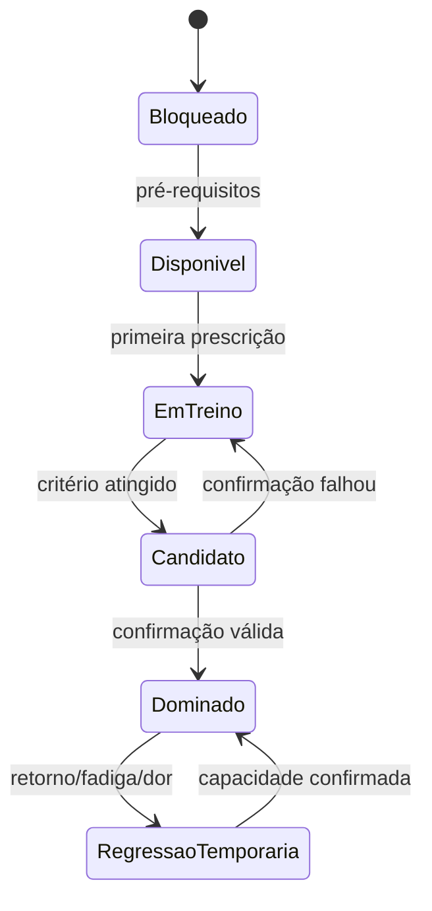

# Regras de Progressão, Regressão e Platô

## 1. Estados de um nó



## 2. Critério de domínio

Cada nó define:

- mínimo e máximo de séries;
- repetições ou tempo por série;
- RPE/RIR aceitável;
- amplitude e checklist técnico;
- número de sessões de confirmação;
- intervalo mínimo entre evidências;
- pré-requisitos de outros padrões;
- equipamento e ambiente;
- bloqueios de segurança.

Exemplo conceitual:

```yaml
mastery_rule:
  exercise: push_up_floor
  sets: 3
  reps_per_set: 10
  min_rir: 1
  max_rpe: 9
  technique_score_min: 0.85
  confirmations: 2
  min_hours_between: 48
  pain_max: 0
```

Os valores são conteúdo versionado, não constantes no aplicativo.

## 3. Promoção

Ao dominar:

- manter parte do volume na variação dominada;
- introduzir a próxima em poucas séries/reps;
- nunca fazer troca total imediata em habilidade de alto risco;
- atualizar atributo e mapa;
- conceder recompensa uma única vez;
- explicar pré-requisitos restantes se houver ramificação.

## 4. Regressão

Tipos:

- **de dose:** menos reps/séries/tempo;
- **de alavanca:** variação mais acessível;
- **de amplitude:** amplitude confortável e segura, quando aprovada;
- **de assistência:** mais apoio/elástico/contrapeso;
- **temporária:** prontidão baixa ou retorno;
- **por técnica:** reaprender padrão sem apagar domínio histórico.

## 5. Platô

Definição inicial: ausência de melhora significativa em 3–5 exposições comparáveis, sem explicação por falta de adesão. Antes de agir, verificar:

1. dados e técnica;
2. sono, estresse e prontidão;
3. adesão e intervalo entre sessões;
4. volume insuficiente ou excessivo;
5. especificidade;
6. equipamento/assistência inconsistente;
7. necessidade de deload;
8. necessidade de nova progressão intermediária.

Possíveis ações, uma por vez:

- repetir com alvo diferente dentro da mesma faixa;
- microincrementar volume;
- aumentar descanso;
- adicionar pausa/cadência;
- trocar acessório;
- deload;
- regressão técnica;
- reavaliação.

## 6. Deload

Pode ser planejado no fim de fase ou acionado por combinação de:

- queda persistente de desempenho;
- fadiga e dor muscular elevadas;
- RPE acima do esperado;
- baixa motivação incomum;
- alto volume acumulado;
- agenda/estresse excepcional.

Durante deload, reduzir dose e/ou dificuldade; não bloquear o usuário por “não cumprir missão”.

## 7. Recordes

Separar recordes por:

- versão/variação;
- amplitude e assistência;
- reps, tempo ou dificuldade;
- contexto de teste vs treino;
- evidência e confiança.

Não comparar “barra com elástico” a “barra livre” em um único recorde.

## 8. Regra de segurança

Qualquer registro com dor impeditiva, sintoma, técnica inválida ou integridade suspeita:

- pode aparecer no histórico pessoal;
- não serve como evidência de domínio;
- não gera recorde validado;
- não avança ranking competitivo;
- aciona fluxo apropriado.
