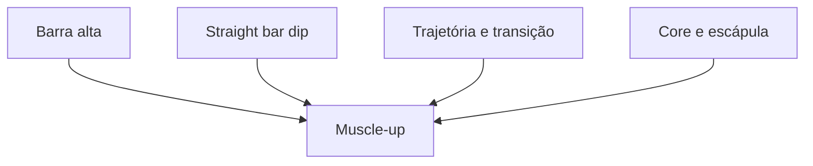

# Habilidades Extremas e Portões de Segurança

## 1. Objetivo

Definir habilidades finais como projetos de longo prazo, não como exercícios inseridos cedo para aumentar engajamento.

## 2. Matriz de pré-requisitos

Os números de desempenho exatos devem ficar em regras de conteúdo validadas. Esta matriz define categorias obrigatórias.

| Habilidade | Força específica | Controle/core | Articulação/ambiente | Evidência |
|---|---|---|---|---|
| Muscle-up estrito | barra alta + dip/straight bar dip | hollow e trajetória | barra estável, espaço | duas confirmações |
| Handstand livre | pike/overhead | linha e saída segura | punho/ombro tolerantes, parede | prática sem dor |
| HSPU livre | HSPU parede | handstand consistente | superfície segura | domínio de força + equilíbrio |
| Front lever | puxada e remada fortes | anti-extensão | hang confortável | holds progressivos |
| Back lever | suporte/puxada | linha corporal | ombro preparado | progressões sem dor |
| Full planche | pseudo planche e suportes | protração e hollow | punho/cotovelo preparados | holds progressivos |
| Human flag | puxar/empurrar lateral | core lateral | poste/barra segura | ambos os lados |
| Pistol squat | unilateral e mobilidade funcional | equilíbrio | amplitude sem dor | ambos os lados |
| Nordic curl | cadeia posterior excêntrica | controle pélvico | ancoragem certificada | progressões excêntricas |
| Dragon flag | core/posterior progressivo | anti-extensão | apoio estável | negativa antes da completa |

## 3. Portões universais

Uma habilidade elite só fica `Disponível` quando:

- todos os pré-requisitos obrigatórios estão dominados;
- triagem e check-in não têm bloqueio relevante;
- o usuário concluiu tutorial de saída/falha;
- equipamento e espaço foram confirmados;
- não há dor atual no padrão;
- existe dose semanal compatível;
- regra possui revisão profissional ativa;
- tentativa não ocorre sob fadiga incompatível.

## 4. Prática inicial

- 2–4 exposições técnicas muito curtas por semana podem ser preferíveis a uma sessão exaustiva, conforme a habilidade;
- poucas tentativas de alta qualidade;
- descanso amplo;
- interromper antes de degradação;
- complementos fortalecem o elo limitante;
- não testar máximo toda semana.

## 5. Dependências compostas

O mesmo mecanismo de múltiplas dependências deve ser usado para planche, levers, HSPU e human flag.

## 6. Manutenção

Dominar uma habilidade não significa mantê-la para sempre sem prática. O app distingue:

- conquista histórica;
- capacidade atual confirmada;
- capacidade estimada expirada;
- retorno técnico.

Uma habilidade expirada continua no perfil como conquista, mas pode exigir confirmação antes de tentativas intensas ou ranking.

## 7. Conteúdo não liberado no MVP

Movimentos com risco elevado, acrobacias, quedas, giros, balanços extremos e variações sem saída segura devem permanecer ocultos até existirem:

- protocolo completo;
- revisão profissional;
- requisitos cruzados;
- vídeo de saída;
- telemetria de incidentes;
- critérios de ambiente.
