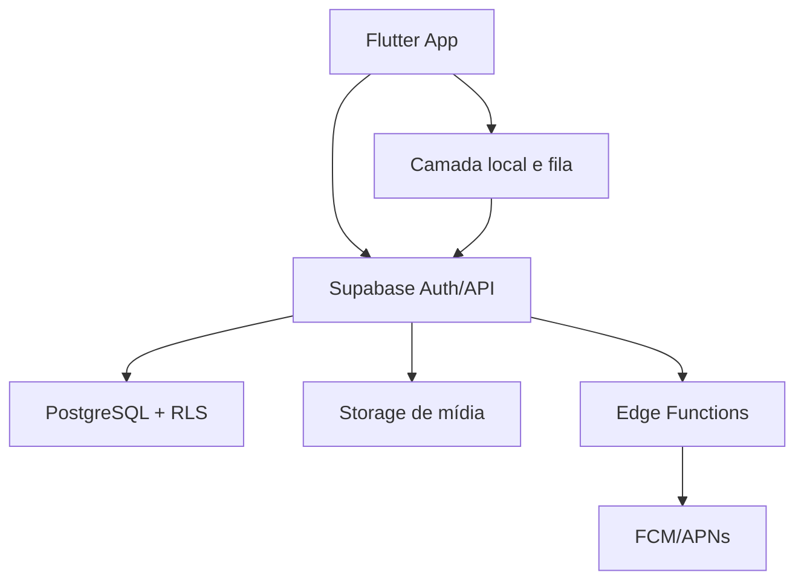

# Arquitetura Técnica

## 1. Stack proposta

- **Cliente:** Flutter/Dart, Android e iOS;
- **Estado:** solução previsível com separação de apresentação/domínio/dados;
- **Local:** SQLite/Drift ou equivalente para sessão offline e fila;
- **Backend:** Supabase Auth, PostgreSQL, Storage, Realtime quando necessário e Edge Functions;
- **Push:** Firebase Cloud Messaging, com APNs no iOS;
- **Observabilidade:** erros, performance e eventos com anonimização;
- **CI/CD:** análise, testes, migrations, builds e ambientes separados.

## 2. Componentes



## 3. Módulos Flutter

```text
lib/
  app/
  core/
    auth/
    database/
    networking/
    sync/
    telemetry/
    accessibility/
  features/
    onboarding/
    safety/
    assessment/
    training_plan/
    workout_session/
    exercises/
    skill_tree/
    gamification/
    progress/
    profile/
    notifications/
  shared/
```

Cada feature contém `domain`, `data` e `presentation` conforme necessidade. Regras críticas não ficam apenas em widgets.

## 4. Fonte de verdade

| Dado | Autoridade |
|---|---|
| sessão em andamento | banco local até sincronização |
| catálogo publicado | backend, com cache local versionado |
| plano ativo | backend; cópia local para execução |
| XP e nível | backend |
| domínio | backend |
| timer visual | cliente |
| fila offline | cliente, reconciliada no backend |
| regras | backend/versionadas em migrations e conteúdo |

## 5. Sincronização offline

1. criar `client_session_id` antes de iniciar;
2. persistir cada série como evento local;
3. marcar sessão concluída localmente;
4. inserir na fila com tentativas e backoff;
5. backend faz upsert/idempotência;
6. backend processa recompensa uma vez;
7. cliente recebe recibo e atualiza estado;
8. conflito mantém histórico e exibe status.

Nunca depender do fechamento perfeito do aplicativo.

## 6. Ambientes

- local/teste;
- desenvolvimento;
- homologação;
- produção.

Projetos Supabase, chaves, buckets, credenciais FCM e telemetria devem ser separados. Migrations são aplicadas por pipeline; alterações manuais em produção são proibidas.

## 7. Segurança

- RLS em tabelas acessadas pelo cliente;
- service role apenas no backend;
- validação de payload;
- limites de requisição;
- URLs assinadas para mídia privada;
- logs sem respostas de triagem em texto aberto;
- tokens seguros no dispositivo;
- App Check/atestado de integridade pode ser camada adicional, não única defesa;
- exclusão de conta com processo auditável.

## 8. Regras versionadas

Toda prescrição aponta para:

- `catalog_version`;
- `training_rule_version`;
- `mastery_rule_version`;
- `gamification_version`.

Uma atualização não recalcula passado sem job explícito e auditado.

## 9. IA e câmera — fase posterior

IA pode:

- resumir histórico;
- explicar decisão já calculada;
- sugerir conteúdo ao profissional;
- estimar pontos de técnica com confiança.

IA não deve:

- ignorar bloqueios;
- diagnosticar;
- conceder domínio sozinha em habilidade crítica;
- alterar prescrição sem regra e auditoria;
- inventar exercícios fora do catálogo publicado.

## 10. Decisões arquiteturais a registrar

Criar ADRs para:

- mecanismo de estado Flutter;
- banco local;
- formato da fila offline;
- motor de regras no Postgres/serviço;
- estratégia de conteúdo e mídia;
- política de eventos;
- análise de vídeo;
- assinatura e pagamentos.
