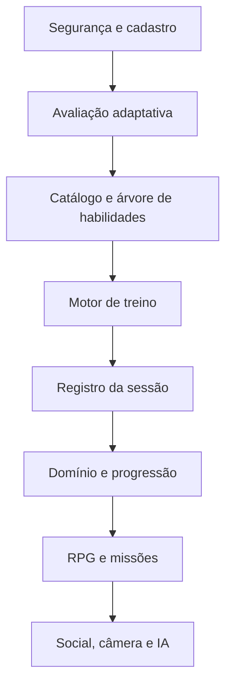

# App RPG de Calistenia — Documentação Mestre

**Status:** especificação funcional e técnica inicial  
**Versão:** 1.0  
**Atualizado em:** 22/07/2026  
**Público-alvo:** produto, UX/UI, Educação Física, desenvolvimento Flutter, backend e QA

## 1. Propósito

Este repositório descreve um aplicativo no qual o corpo do usuário é o personagem. O sistema avalia o ponto de partida, cria um programa adaptado à disponibilidade e aos equipamentos, registra o desempenho e conduz o usuário por progressões de calistenia do extremo básico ao extremo avançado.

O aplicativo não é um catálogo de exercícios. Ele é um sistema de decisão com cinco responsabilidades:

1. proteger o usuário por meio de triagem, limites e interrupções;
2. escolher uma variação compatível com a capacidade atual;
3. gerar e adaptar uma carga semanal recuperável;
4. comprovar domínio antes de liberar movimentos mais difíceis;
5. transformar consistência e evolução em uma jornada de RPG.

## 2. Princípios imutáveis

- **Segurança vence gamificação:** dor, sintomas ou risco interrompem desafios e sequências.
- **Técnica vence quantidade:** repetição inválida não conta para teste de domínio.
- **XP não prova capacidade:** XP representa jornada; domínio físico depende de critérios técnicos.
- **Progressão é específica:** empurrar, puxar, pernas, core, equilíbrio e mobilidade evoluem separadamente.
- **O treino é adaptável:** sono, dor, esforço, desempenho e disponibilidade alteram o plano.
- **Backend é autoridade:** XP, desbloqueios, recordes, temporadas e regras competitivas são calculados no servidor.
- **Sem punição por recuperação:** descanso e deload fazem parte do progresso.
- **Conteúdo clínico não é automatizado:** o app não diagnostica, trata lesões nem substitui profissionais.

## 3. Mapa da documentação

| Ordem | Documento | Finalidade |
|---:|---|---|
| 1 | `00_VISAO/PRODUCT_VISION.md` | Visão, público, proposta e escopo |
| 2 | `00_VISAO/GLOSSARY.md` | Vocabulário oficial do domínio |
| 3 | `01_SAFETY/SAFETY_AND_SCREENING.md` | Triagem, dor, sinais de alerta e limites |
| 4 | `02_PRODUCT/REQUIREMENTS.md` | Requisitos funcionais e não funcionais |
| 5 | `02_PRODUCT/USER_JOURNEYS.md` | Jornadas principais e estados do usuário |
| 6 | `03_ASSESSMENT/INITIAL_ASSESSMENT.md` | Avaliação adaptativa inicial |
| 7 | `03_ASSESSMENT/SCORING_AND_PLACEMENT.md` | Pontuação e colocação nas trilhas |
| 8 | `04_TRAINING/TRAINING_ENGINE.md` | Motor de geração e adaptação de treino |
| 9 | `04_TRAINING/WEEKLY_TEMPLATES.md` | Planos de 2 a 6 dias e duração variável |
| 10 | `04_TRAINING/PROGRESSION_RULES.md` | Promoção, regressão, platô e deload |
| 10A | `04_TRAINING/PROGRAM_LIBRARY.md` | Fases completas e especializações |
| 11 | `05_EXERCISES/EXERCISE_SCHEMA.md` | Modelo de dados de cada exercício |
| 12 | `05_EXERCISES/SKILL_TREES.md` | Trilhas do básico ao avançado |
| 13 | `05_EXERCISES/EXTREME_SKILLS.md` | Habilidades finais e seus pré-requisitos |
| 14 | `06_GAMIFICATION/RPG_SYSTEM.md` | XP, níveis, classes, missões e bosses |
| 15 | `06_GAMIFICATION/ECONOMY_AND_ANTI_ABUSE.md` | Economia, recompensas e antifraude |
| 16 | `07_UX/SCREENS_AND_FLOWS.md` | Telas, navegação e estados de interface |
| 17 | `08_ARCHITECTURE/TECHNICAL_ARCHITECTURE.md` | Arquitetura Flutter/Supabase/FCM |
| 18 | `08_ARCHITECTURE/DATA_MODEL.md` | Entidades, relações e invariantes |
| 19 | `08_ARCHITECTURE/BACKEND_RULES.md` | RPCs, jobs, RLS e idempotência |
| 20 | `09_QUALITY/TEST_STRATEGY.md` | Testes funcionais, de regra e segurança |
| 20A | `09_QUALITY/RELEASE_CHECKLIST.md` | Portões para piloto e produção |
| 21 | `10_DELIVERY/ROADMAP.md` | MVP, versões e critérios de saída |
| 22 | `10_DELIVERY/IMPLEMENTATION_PROMPT.md` | Prompt de início para Claude Code/Codex |
| 23 | `REFERENCES.md` | Referências e decisões baseadas em evidência |

## 4. Ordem recomendada de implementação

## 5. Definição de aplicativo completo

O produto será considerado funcionalmente completo quando conseguir:

- atender um adulto destreinado que ainda não faz flexão no chão;
- adaptar testes e exercícios por equipamento e restrições declaradas;
- planejar de 2 a 6 dias por semana, com 15 a 90 minutos por sessão;
- cobrir padrões de empurrar, puxar, agachar, hinge, core, suporte, equilíbrio e mobilidade;
- evoluir habilidades sem saltos perigosos entre variações;
- reagir a dor, fadiga, falhas, ausência, platô e desempenho acima do previsto;
- permitir metas avançadas como muscle-up, handstand push-up, front lever, back lever, planche, pistol squat e Nordic curl;
- manter regras auditáveis e versionadas;
- funcionar offline durante uma sessão e sincronizar sem duplicar recompensas;
- oferecer histórico, testes de fase, missões, temporadas e cosméticos sem incentivar excesso de treino.

## 6. Aviso de escopo

Esta documentação é uma especificação de produto e engenharia. Antes da publicação, protocolos, vídeos, critérios técnicos e mensagens de segurança devem ser revisados e aprovados por profissional de Educação Física habilitado e, quando necessário, por profissionais de saúde e assessoria jurídica da jurisdição atendida.
