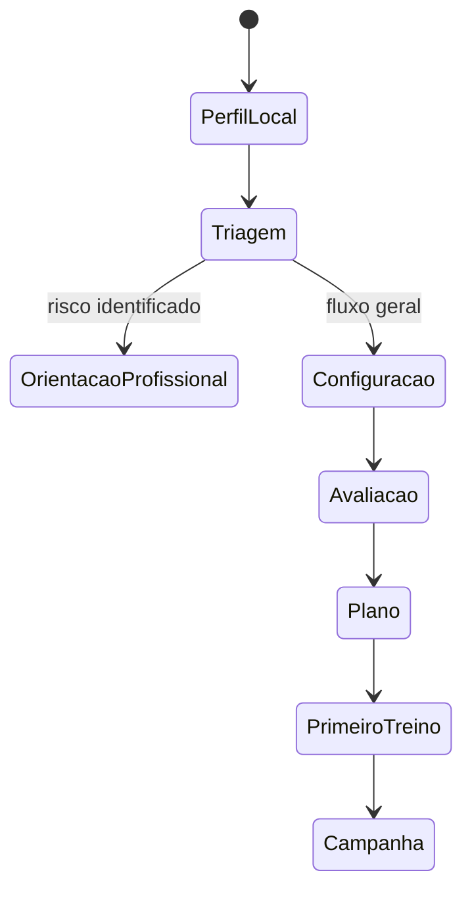

# Jornadas e Estados do Usuário

## 1. Primeira jornada

### Passos

1. criar personagem e aceitar termos;
2. concluir triagem;
3. informar objetivo, agenda e equipamento;
4. aprender a escala de esforço e repetição válida;
5. executar avaliação adaptativa ou optar por colocação conservadora;
6. revisar resultado por atributo;
7. escolher uma campanha/meta;
8. receber semana 1;
9. concluir tutorial de treino;
10. ganhar a primeira recompensa sem artificialmente inflar XP.

## 2. Jornada de uma sessão

1. check-in de prontidão;
2. ajuste sugerido e aceito automaticamente quando for apenas redução segura;
3. aquecimento contextual;
4. bloco de habilidade/técnica;
5. bloco principal de força;
6. acessórios e core;
7. volta à calma opcional;
8. resumo com esforço, dor e observações;
9. processamento transacional no banco local;
10. XP, progresso e próximo passo.

## 3. Jornada de desbloqueio

- usuário atinge o critério na primeira sessão;
- app mostra “candidato a domínio”, sem liberar ainda quando confirmação é exigida;
- nova exposição ocorre após recuperação adequada;
- critério técnico e quantitativo é novamente alcançado;
- serviço de domínio local registra evidências e regra;
- nó é dominado;
- próxima variação entra como prática de baixa dose, não substitui todo o volume imediatamente.

## 4. Jornada de dificuldade excessiva

- duas séries ficam abaixo do mínimo ou RPE excede o limite;
- app reduz alvo na sessão;
- na próxima sessão, mantém exercício com dose menor ou usa regressão;
- se persistir por duas exposições, recalibra o nó;
- nenhuma conquista histórica é removida;
- usuário recebe explicação sem linguagem de fracasso.

## 5. Jornada de dor

- usuário toca em “senti dor”;
- exercício é interrompido;
- app pergunta intensidade/local e verifica alertas;
- padrão é bloqueado ou recebe alternativa conservadora;
- bônus de conclusão perfeita é substituído por recompensa de decisão segura;
- recomendação profissional é apresentada quando aplicável;
- retorno exige novo check-in e, se necessário, reavaliação.

## 6. Jornada após ausência

| Ausência | Retorno inicial sugerido |
|---:|---|
| 1–7 dias | Retomar com ajuste por prontidão |
| 8–14 dias | Reduzir volume/dificuldade moderadamente |
| 15–28 dias | Semana de retorno e confirmação de nós |
| Mais de 28 dias | Reavaliação curta obrigatória antes do plano normal |

Valores exatos devem ser configuráveis e aprovados por especialista.

## 7. Estados persistentes

- onboarding pendente;
- triagem válida/expirada/requer revisão;
- sem avaliação;
- plano ativo/pausado/encerrado;
- sessão programada/em execução/processando/processada;
- fase ativa/boss disponível/fase concluída;
- nó bloqueado/disponível/em treino/candidato/dominado/temporariamente regressado;
- perfil local normal/reiniciado/apagamento solicitado.

## 8. Casos de borda

- usuário não possui barra após iniciar plano;
- agenda cai de 5 para 2 dias;
- todo o fluxo é executado em modo avião;
- aplicativo fecha no descanso;
- relógio do aparelho é alterado;
- a mesma sessão é finalizada duas vezes;
- catálogo local é atualizado durante a semana;
- usuário marcou repetições incompatíveis com o histórico;
- teste dá empate entre duas variações;
- plano tem menos tempo do que o mínimo para todos os blocos.

Cada caso deve ter comportamento determinístico descrito nos documentos técnicos.
