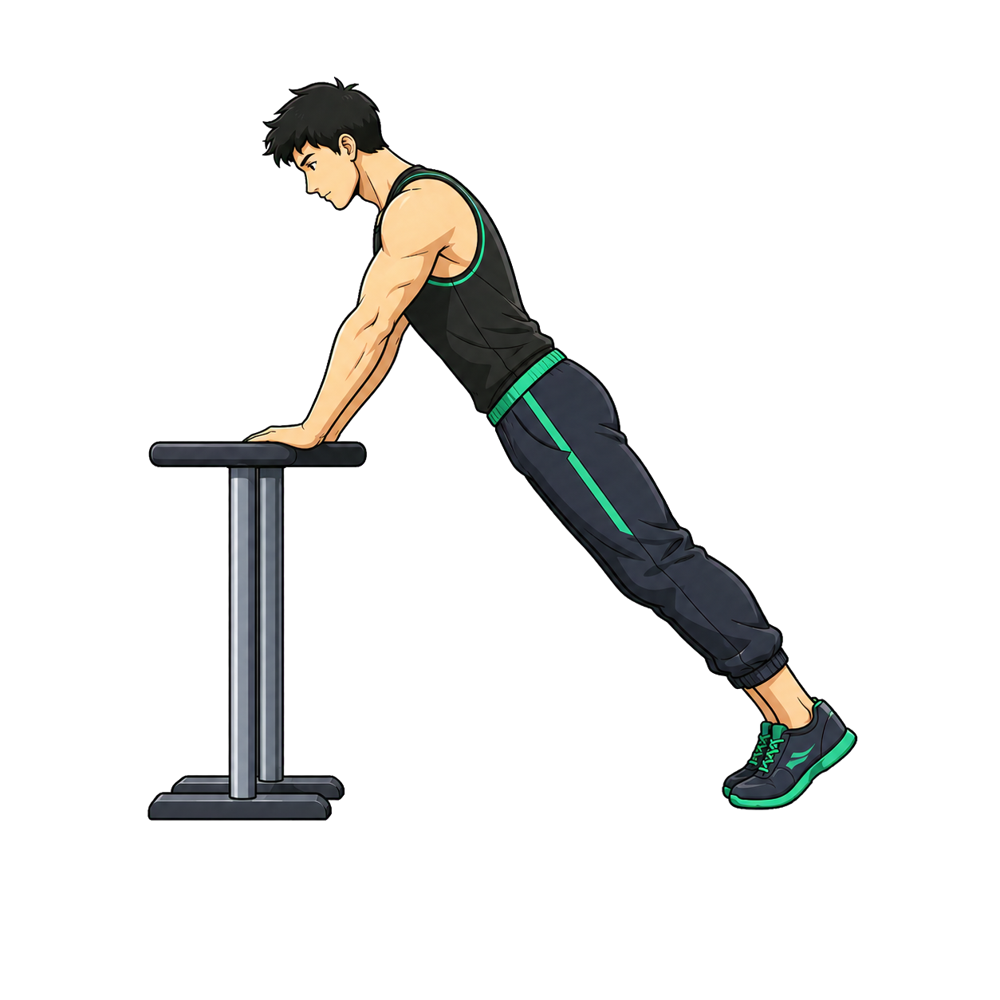
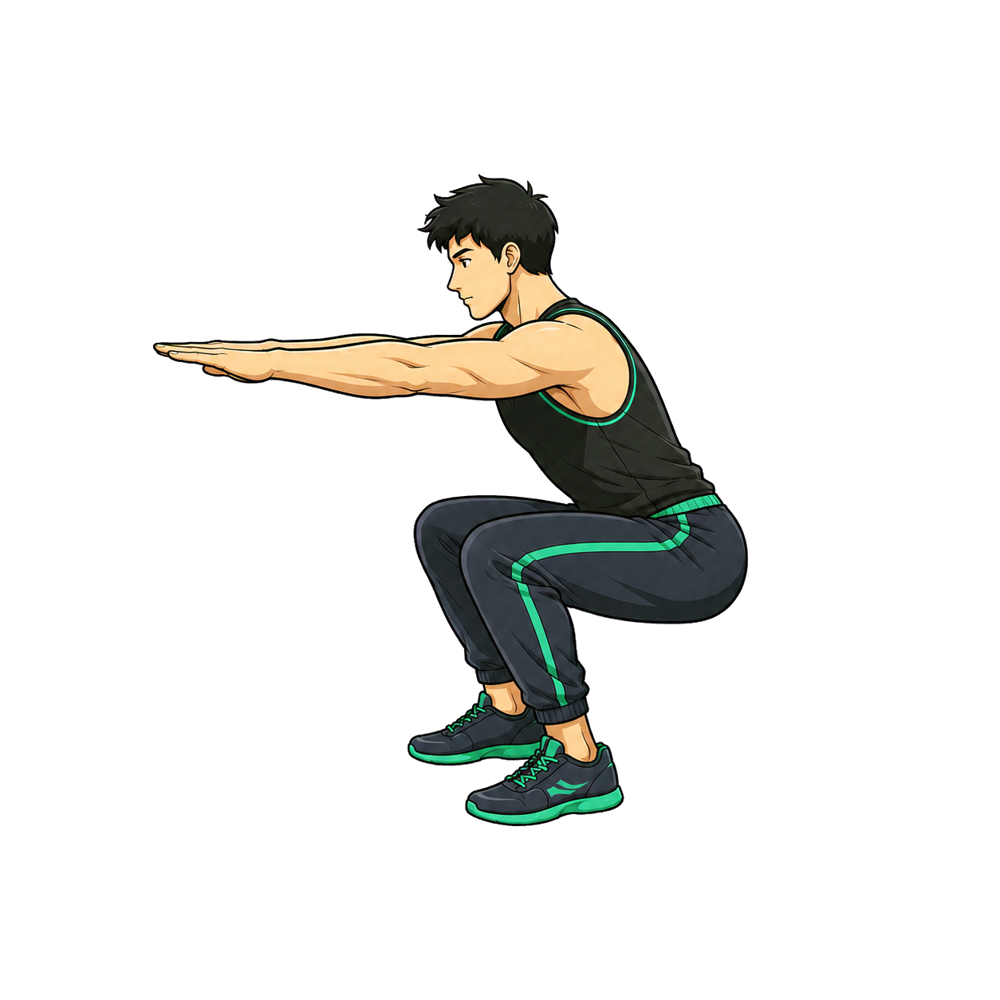
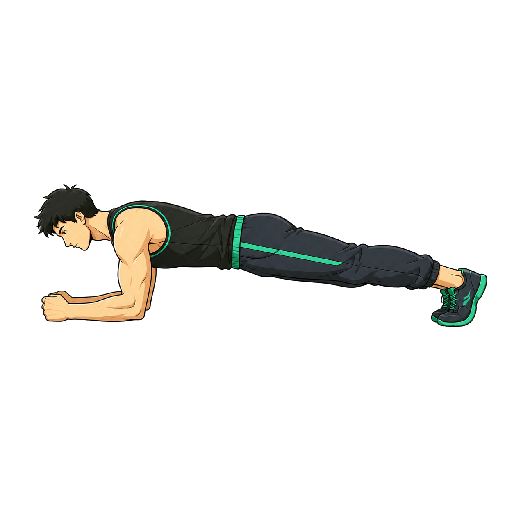
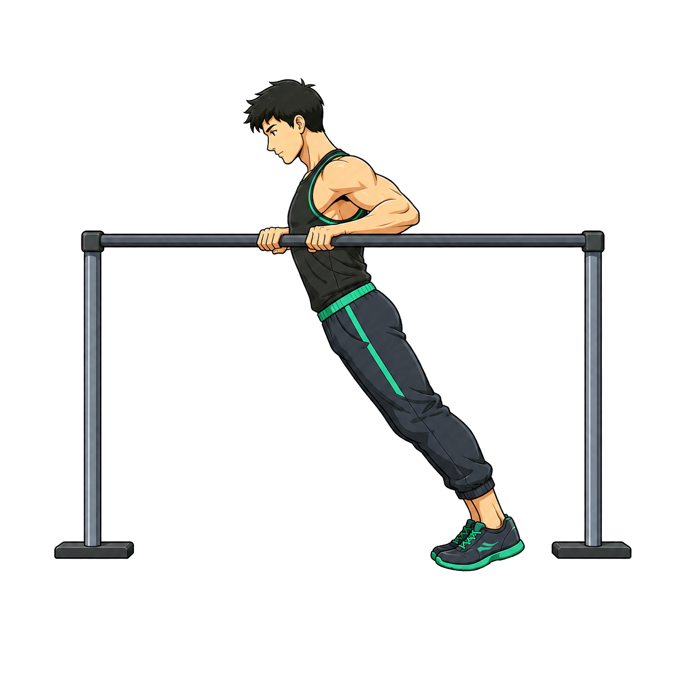
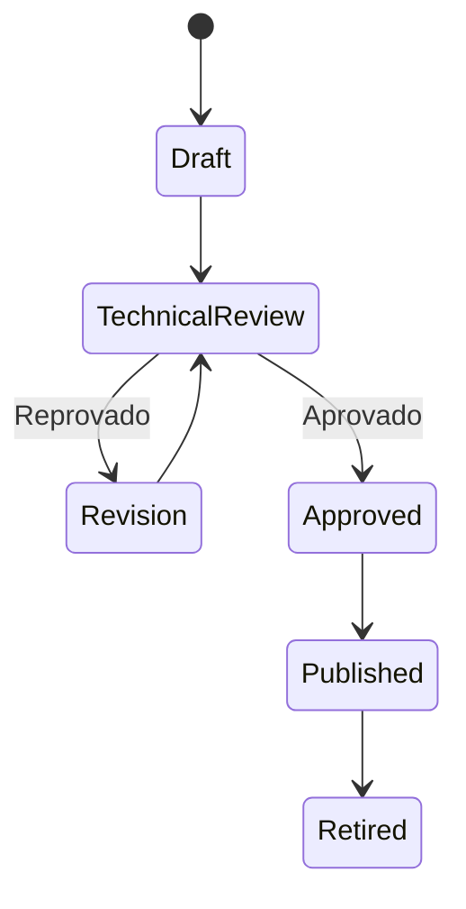

# Guia de Imagens, Animações e Mídia dos Exercícios

**Versão:** 1.0  
**Integra a documentação mestre:** 1.2

## 1. Objetivo

Cada versão de exercício possui um espaço de mídia desde o início, mesmo que o
arquivo definitivo ainda não exista. Assim, imagens estáticas podem ser
substituídas posteriormente por WebP animado, GIF ou vídeo curto sem alterar o
motor de treino.

## 2. Kit visual inicial

Foram criadas quatro ilustrações estáticas transparentes para estabelecer a
direção artística:

| Exercício | Arquivo | Papel |
|---|---|---|
| Flexão inclinada | `../assets/exercises/starter/push_up_incline_start.png` | posição inicial |
| Agachamento livre | `../assets/exercises/starter/bodyweight_squat_bottom.png` | posição inferior |
| Prancha de antebraços | `../assets/exercises/starter/forearm_plank_hold.png` | posição sustentada |
| Remada australiana | `../assets/exercises/starter/australian_row_top.png` | protótipo de posição final |









Essas imagens são protótipos de conteúdo, não validação técnica. Antes de
entrarem numa versão pública, um profissional de Educação Física deve conferir
posição, equipamento, amplitude, público e instruções.

## 3. Cobertura do catálogo

As árvores contêm cerca de 180 etapas. Não usar uma arte genérica como se fosse
uma demonstração correta de todas elas.

Política:

- todo exercício recebe `media_key` e fallback;
- movimentos fundamentais do MVP precisam de mídia revisada antes do piloto;
- progressões bloqueadas podem permanecer com placeholder;
- um nó elite não pode ser publicado para treino apenas porque possui imagem;
- mídia e instruções devem corresponder à mesma `exercise_version`.

## 4. Estrutura de assets no aplicativo

Quando o Flutter for implementado:

```text
assets/
└── images/
    └── exercises/
        ├── _placeholder/
        │   ├── generic_static.webp
        │   └── unavailable.webp
        ├── push_up_incline/
        │   └── v1/
        │       ├── thumbnail.webp
        │       ├── start.webp
        │       ├── end.webp
        │       └── demo.webp
        ├── bodyweight_squat/
        │   └── v1/
        └── forearm_plank/
            └── v1/
```

Não usar nomes traduzidos, espaços, acentos ou maiúsculas nos paths.

## 5. Convenção

```text
assets/images/exercises/<exercise_slug>/v<version>/<role>.<ext>
```

Papéis:

- `thumbnail`;
- `start`;
- `mid`;
- `end`;
- `demo`;
- `setup`;
- `exit`;
- `common_error_01`.

Exemplo:

```text
assets/images/exercises/push_up_incline/v1/demo.webp
```

## 6. Formatos

| Uso | Preferência | Observação |
|---|---|---|
| thumbnail | WebP estático | leve e local |
| posição | WebP ou PNG | transparência quando necessária |
| animação curta | WebP animado | loop de 2–4 s |
| vídeo técnico | MP4 local | somente quando necessário |
| fallback | WebP estático | incluído no bundle |

GIF é aceito como conteúdo provisório, mas não é o formato preferencial por
tamanho e eficiência.

## 7. Especificação da imagem

### Thumbnail

- 512 × 512 px;
- fundo transparente ou consistente com o card;
- movimento reconhecível;
- sujeito inteiro;
- sem texto incorporado.

### Imagem principal

- 1024 × 1024 px;
- PNG ou WebP;
- fundo transparente;
- sujeito e equipamento completos;
- 10% de área segura;
- `BoxFit.contain`;
- sem corte;
- sem marca.

### Animação

- 2–4 segundos;
- 12–24 fps;
- início e fim claros;
- loop suave somente quando o movimento permitir;
- câmera fixa;
- mesma escala;
- sem zoom;
- sem texto;
- pausar com “reduzir animações”.

## 8. Ângulos

Escolher o ângulo que torna os critérios observáveis:

- flexão: lateral;
- agachamento: lateral ou três-quartos;
- remada: lateral;
- barra: frontal e lateral quando necessário;
- mobilidade: plano que mostre articulação e amplitude;
- movimentos assimétricos: registrar o lado;
- handstand e levers: corpo completo e equipamento.

Alguns exercícios exigem mais de uma mídia. Não forçar todos a uma única
imagem.

## 9. Representação

O catálogo final deve:

- representar diferentes gêneros, tons de pele e corpos;
- manter roupa adequada e contraste;
- não sexualizar;
- não associar iniciante a fracasso;
- evitar músculos exagerados como única representação;
- permitir personagens visuais desbloqueáveis sem alterar a técnica.

O kit inicial usa um personagem neutro apenas para estabelecer o estilo.

## 10. Manifesto de mídia

Cada exercício publicado possui:

```yaml
exercise_media:
  id: uuid
  exercise_id: uuid
  exercise_version: 1
  media_key: push_up_incline_v1_start
  role: start
  media_type: static_image
  asset_path: assets/images/exercises/push_up_incline/v1/start.webp
  fallback_asset_path: assets/images/exercises/_placeholder/generic_static.webp
  status: available
  width: 1024
  height: 1024
  duration_ms: null
  loop: false
  locale: null
  semantic_label_pt_br: "Posição inicial da flexão inclinada"
  instruction_version: 1
  technical_review_status: pending
  reviewed_by: null
  reviewed_at: null
  checksum: sha256
```

## 11. Resolução automática

```text
resolveMedia(exerciseVersion):
  tentar demo revisado
  senão tentar start + end revisados
  senão tentar imagem principal revisada
  senão retornar placeholder
```

Nunca construir path somente por concatenação sem validar o manifesto. O
manifesto é a fonte de disponibilidade e revisão.

## 12. Placeholder

O placeholder contém:

- silhueta neutra;
- ícone do padrão;
- nome do exercício fora da imagem;
- texto `Demonstração visual em preparação`;
- botão `Ver instruções`;
- critérios de repetição;
- erros comuns;
- configuração do equipamento.

Não exibir caixa quebrada, caminho do arquivo ou erro técnico.

## 13. Carregamento

- assets são locais;
- pré-carregar mídia do exercício atual e seguinte;
- liberar decodificações antigas;
- pausar animações em background;
- aplicar limite de memória;
- não bloquear o timer por decodificação;
- erro de mídia deve ser recuperável.

## 14. Revisão de conteúdo

Fluxo:



Checklist:

- nome;
- versão;
- início;
- fim;
- amplitude;
- respiração;
- alinhamento;
- equipamento;
- saída segura;
- erros;
- público;
- contraste;
- licença;
- acessibilidade.

## 15. Controle de qualidade automatizado

Criar futuramente:

```text
tool/check_exercise_media.dart
```

O verificador deve:

- ler o catálogo;
- listar exercício publicado sem mídia;
- verificar paths;
- verificar dimensões;
- calcular checksum;
- detectar chave duplicada;
- validar status;
- impedir path absoluto;
- impedir URL no MVP offline;
- gerar relatório Markdown.

## 16. Inventário esperado

Para cada `exercise_slug`:

```text
[ ] thumbnail
[ ] start
[ ] end, se dinâmico
[ ] demo, se necessário
[ ] setup, se equipamento complexo
[ ] semantic label
[ ] revisão técnica
[ ] licença/proveniência
[ ] checksum
```

O inventário é derivado dos slugs de `SKILL_TREES.md` e do catálogo real. Não
manter uma lista manual paralela que possa ficar desatualizada.

## 17. Prompts-base para produzir o restante

### 17.1 Imagem estática

```text
Crie uma ilustração estática 1024 × 1024 para demonstrar [EXERCÍCIO],
versão [VERSÃO], na posição [INICIAL/FINAL].

Mostre o corpo inteiro e todo o equipamento, no ângulo [ÂNGULO]. Preserve:
[CRITÉRIOS TÉCNICOS]. Evite: [ERROS COMUNS].

Estilo: ilustração fitness semi-flat premium, contornos limpos, roupa
carvão com detalhes verde-menta, personagem adulto não identificável.
Fundo transparente, margem segura de 10%, sem texto, marca, sombra ou corte.

A imagem será submetida à revisão de um profissional de Educação Física e não
deve ser publicada automaticamente.
```

### 17.2 Animação

```text
Crie uma demonstração em loop de 2–4 segundos para [EXERCÍCIO], versão
[VERSÃO], mostrando preparação, movimento controlado e retorno.

Use câmera fixa em [ÂNGULO], corpo e equipamento inteiros, escala constante,
sem zoom e sem texto. Preserve [CRITÉRIOS]. Evite [ERROS].

Entregue WebP animado otimizado e frames inicial/final. A animação deverá ser
revisada tecnicamente antes da publicação.
```

## 18. Migração das imagens deste pacote

Ao implementar o aplicativo, copiar os protótipos:

```text
App_RPG_Calistenia_Documentacao/assets/exercises/starter/
```

para paths versionados dentro de:

```text
assets/images/exercises/
```

Depois:

1. converter para WebP, se aprovado;
2. registrar no manifesto;
3. adicionar ao `pubspec.yaml`;
4. testar fundo escuro e claro;
5. testar aparelho compacto;
6. revisar técnica;
7. atualizar `PROJECT_STATUS.md`.

## 19. Regra de substituição futura

Trocar mídia não altera histórico nem prescrição quando:

- exercício e instruções continuam iguais;
- o papel continua igual;
- a nova mídia apenas melhora qualidade.

Se a mídia mostrar técnica, amplitude ou equipamento diferentes, criar nova
versão de conteúdo e nova revisão.

