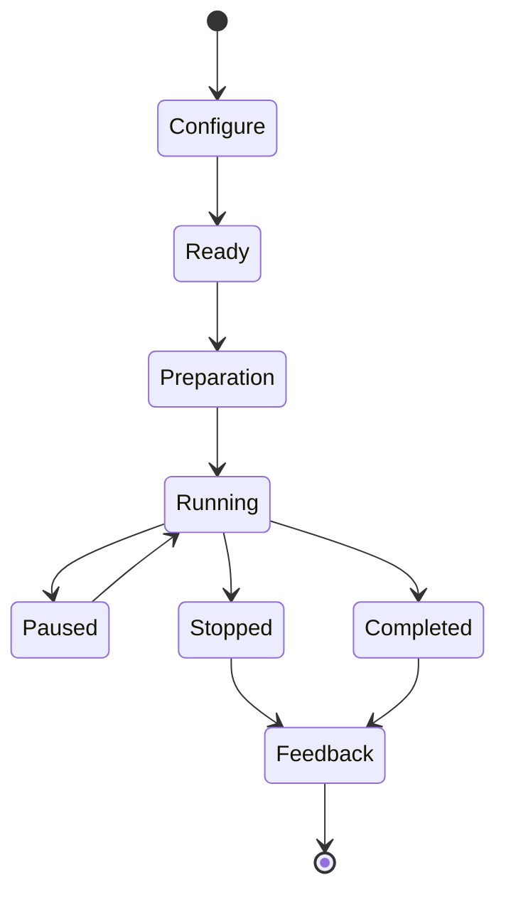

# Página de Configurações, Perfil Físico e Exercícios por Tempo

**Código do módulo:** `SETTINGS-TIMER-001`  
**Status:** especificação funcional e técnica pronta para implementação  
**Versão:** 1.0  
**Atualizado em:** 24/07/2026  
**Dependências:** perfil local, avaliação física, catálogo de exercícios, motor de treino e banco local

## 1. Objetivo

Este documento especifica:

1. o acesso à página de configurações por uma engrenagem no canto superior direito da dashboard;
2. a edição do perfil físico, incluindo peso, altura e cálculo de IMC;
3. dados complementares para melhorar a avaliação e a geração de treinos;
4. a reavaliação física voluntária e a reavaliação obrigatória após reinício;
5. o reinício completo da jornada sem apagar o perfil local;
6. preferências úteis de treino, acessibilidade, privacidade e notificações;
7. um contador regressivo configurável para alongamentos, mobilidade, isometrias e outros exercícios prescritos por tempo.

Este módulo deve preservar os princípios do projeto:

- segurança prevalece sobre gamificação;
- XP não comprova capacidade física;
- na primeira versão, serviços de domínio e transações locais são autoridade
  sobre reset, XP, domínio e desbloqueios;
- informações físicas e de saúde são privadas;
- nenhuma classificação de IMC representa diagnóstico;
- o tempo escolhido pelo usuário não pode ultrapassar os limites seguros definidos no catálogo.

---

## 2. Escopo

### 2.1 Incluído

- ícone de engrenagem na dashboard;
- tela de configurações organizada por seções;
- perfil físico e preferências de treino;
- cálculo e histórico de IMC;
- dados de composição corporal opcionais;
- prontidão e recuperação;
- fluxo de refazer avaliação;
- fluxo de recomeçar do zero;
- configurações do cronômetro;
- contador regressivo para exercícios por duração;
- funcionamento offline do timer;
- finalização local idempotente;
- migrations do banco local, transações, auditoria local e testes;
- preparação de IDs e versões para uma futura sincronização com Supabase,
  sem implementar conexão nesta fase.

### 2.2 Fora do escopo da primeira versão

- diagnóstico médico;
- cálculo automático de percentual de gordura por fotografia;
- recomendação de medicamentos, dieta clínica ou tratamento;
- interpretação de exames laboratoriais;
- prescrição para lesão;
- apagamento de todos os dados locais dentro do mesmo fluxo de reinício;
- liberação de habilidade por IMC, peso ou XP;
- análise automática de técnica por câmera nesta entrega.
- login ou cadastro online;
- Supabase, APIs, RLS, Edge Functions e sincronização em nuvem;
- uso em vários dispositivos;

---

## 3. Distinções obrigatórias

### 3.1 Recomeçar jornada

Apaga a evolução física e de RPG do usuário, mas mantém:

- identificador estável do perfil local;
- consentimentos ainda válidos;
- preferências de acessibilidade;
- preferências de idioma e unidade;
- recibo técnico mínimo do reinício;
- registros que precisem ser retidos por obrigação legal.

O reinício não deve apagar o perfil local.

### 3.2 Apagar todos os dados locais

É uma operação diferente, apresentada em opção separada. Remove perfil,
preferências e jornada do aparelho, equivalendo a limpar os dados do
aplicativo. Deve exigir confirmação própria. Quando o Supabase existir,
`Excluir conta` será um terceiro fluxo separado.

### 3.3 Refazer avaliação

Cria uma nova avaliação versionada. Não edita nem sobrescreve avaliações anteriores, exceto quando a jornada foi reiniciada e o histórico correspondente foi removido conforme a política.

### 3.4 Atualizar perfil físico

Peso, altura ou medidas podem ser atualizados sem reiniciar a jornada. A mudança cria um novo registro histórico e pode sugerir revisão do plano, mas não altera capacidade física automaticamente.

---

## 4. Acesso pela dashboard

### 4.1 Localização

Adicionar um botão com ícone de engrenagem no canto superior direito da `DashboardPage`.

Ordem recomendada do cabeçalho:

1. título ou saudação;
2. espaço flexível;
3. notificações, quando existirem;
4. configurações.

### 4.2 Comportamento

- ícone: `Icons.settings_outlined`;
- tooltip e rótulo semântico: `Configurações`;
- área mínima de toque: 48 × 48 dp;
- ao tocar, abrir a rota `/settings`;
- não esconder a engrenagem quando o nome do usuário for longo;
- preservar o estado da dashboard ao retornar;
- permitir acesso por leitor de tela;
- não exibir badge na engrenagem, salvo pendência crítica e explicável.

### 4.3 Rota

```dart
GoRoute(
  path: '/settings',
  name: 'settings',
  builder: (context, state) => const SettingsPage(),
)
```

Adaptar o exemplo ao roteador já usado pelo projeto. Não adicionar um segundo sistema de navegação.

### 4.4 Critérios de aceite

- o botão aparece no canto superior direito em celulares pequenos e grandes;
- texto ampliado não empurra o botão para fora da tela;
- tocar uma vez abre apenas uma instância da página;
- voltar retorna à dashboard sem recarregar desnecessariamente o treino;
- o ícone possui tooltip, foco e rótulo semântico.

---

## 5. Arquitetura da página

Usar uma `SettingsPage` com seções progressivas. Não colocar todas as informações em um formulário único.

### 5.1 Cabeçalho

- título: `Configurações`;
- avatar e nome do personagem;
- nível da jornada, apenas informativo;
- status de salvamento local ou backup, quando relevante;
- botão `Salvar` somente quando existir alteração não persistida.

### 5.2 Seções

| Ordem | Seção | Conteúdo |
|---:|---|---|
| 1 | Perfil físico | peso, altura, IMC, medidas opcionais e histórico |
| 2 | Avaliação física | resultado atual, validade, limitações e refazer avaliação |
| 3 | Objetivos e rotina | objetivos, dias, duração, local e equipamentos |
| 4 | Recuperação | sono, fadiga, dor muscular, estresse e prontidão |
| 5 | Preferências de treino | timer, contagem preparatória, som, vibração e tela ativa |
| 6 | Notificações | dias, horários, descanso e reavaliação |
| 7 | Acessibilidade | texto, contraste, áudio, vibração e redução de animação |
| 8 | Privacidade e dados | visibilidade, exportação e consentimentos |
| 9 | Ajuda e segurança | orientações, suporte e sinais de interrupção |
| 10 | Zona de risco | recomeçar jornada e apagar todos os dados locais |

### 5.3 Estados da página

Implementar:

- carregando;
- carregada;
- salvando;
- salva;
- erro recuperável;
- erro de persistência local;
- migration local pendente ou incompatível;
- sessão expirada;
- reinício em processamento;
- reinício concluído;
- reavaliação necessária.

---

## 6. Perfil físico

### 6.1 Campos principais

| Campo | Obrigatoriedade | Validação inicial | Uso |
|---|---|---|---|
| Data de nascimento ou faixa etária | obrigatória conforme política | data válida e idade permitida | segurança e protocolo |
| Peso | opcional no cadastro, necessário para IMC | faixa plausível configurável | IMC e histórico |
| Altura | opcional no cadastro, necessária para IMC | faixa plausível configurável | IMC |
| Unidade | obrigatória | métrico ou imperial | exibição e entrada |
| Circunferência da cintura | opcional | número positivo plausível | acompanhamento, sem diagnóstico |
| Percentual de gordura | opcional | origem obrigatória | acompanhamento |
| Frequência cardíaca de repouso | opcional | faixa plausível e confirmação | tendência de recuperação |

Faixas plausíveis devem vir de configuração versionada. Valores fora da faixa não devem ser aceitos silenciosamente. Mostrar confirmação ou bloqueio conforme a severidade.

### 6.2 Origem dos dados

Medidas opcionais devem informar a origem:

- informada pelo usuário;
- balança/dispositivo;
- profissional;
- Health Connect;
- Apple Health.

Integrações externas são futuras. No MVP, usar `self_report`.

### 6.3 Histórico

Cada atualização cria uma nova linha em `body_measurements`. Não sobrescrever a medição anterior.

Mostrar:

- valor atual;
- data da medição;
- variação desde a última medição;
- gráfico opcional;
- opção para ocultar valores sensíveis;
- aviso de que variações diárias podem ocorrer.

### 6.4 Regras

- o peso nunca deve ficar visível em ranking ou perfil público por padrão;
- valores físicos não geram XP;
- perder ou ganhar peso não libera habilidades;
- alteração de peso não recalcula retroativamente treinos ou resultados;
- altura pode ser marcada como estável, mas permanece editável;
- o usuário pode apagar uma medição própria conforme política;
- importações futuras precisam impedir duplicidade.

---

## 7. Cálculo do IMC

### 7.1 Fórmula métrica

```text
altura_m = altura_cm / 100
imc = peso_kg / (altura_m × altura_m)
```

Armazenar peso e altura em unidades canônicas:

- peso: quilogramas;
- altura: centímetros;
- IMC calculado: `numeric(5,2)`.

Arredondar apenas para exibição:

```dart
final heightMeters = heightCm / 100;
final bmi = weightKg / (heightMeters * heightMeters);
final displayBmi = bmi.toStringAsFixed(1);
```

O caso de uso de domínio deve recalcular e validar o IMC antes de persistir no
banco local. Não deixar o cálculo apenas no widget. Na futura fase Supabase, o
servidor fará a mesma validação.

### 7.2 Classificação informativa para adultos

Para o público adulto do MVP:

| IMC | Exibição |
|---:|---|
| abaixo de 18,5 | Abaixo da faixa de referência |
| 18,5 a 24,9 | Faixa de referência |
| 25,0 a 29,9 | Acima da faixa de referência |
| 30,0 ou mais | Muito acima da faixa de referência |

Usar linguagem neutra, sem insultos, metas automáticas ou julgamento.

### 7.3 Menores de idade

Não aplicar as faixas adultas a crianças e adolescentes. Caso o produto futuramente aceite menores:

- exigir fluxo específico de consentimento;
- usar IMC por idade e sexo segundo protocolo aprovado;
- não implementar percentis por aproximação;
- submeter o módulo a revisão profissional e jurídica;
- ocultar a classificação até existir uma implementação validada.

### 7.4 Mensagem obrigatória

Exibir próximo ao resultado:

> O IMC é apenas um indicador de triagem baseado em peso e altura. Ele não mede diretamente gordura, massa muscular, saúde ou capacidade física e não substitui avaliação profissional.

Para praticantes com mais massa muscular, o resultado pode superestimar risco relacionado ao peso.

### 7.5 O IMC pode

- compor o resumo do perfil;
- acompanhar tendência ao longo do tempo;
- sugerir que o usuário procure orientação profissional quando houver resultado extremo ou preocupação;
- ajudar a selecionar linguagem e adaptações conservadoras em conjunto com testes funcionais.

### 7.6 O IMC não pode

- diagnosticar doença;
- determinar sozinho a dificuldade do treino;
- impedir treino sem uma regra de triagem aprovada;
- reduzir ou aumentar XP;
- alterar ranking;
- liberar ou bloquear exercício isoladamente;
- gerar promessa de emagrecimento;
- ser exibido publicamente sem consentimento explícito.

### 7.7 Referências de produto

- [OMS — Body mass index](https://www.who.int/data/gho/data/themes/topics/topic-details/GHO/body-mass-index)
- [OMS — Obesity and overweight](https://www.who.int/news-room/fact-sheets/detail/obesity-and-overweight)
- [CDC — Child and Teen BMI Calculator](https://www.cdc.gov/bmi/child-teen-calculator/index.html)

---

## 8. Informações complementares para avaliação física

O aplicativo deve avaliar o usuário como um todo, sem transformar configurações em prontuário clínico.

### 8.1 Objetivo e experiência

- objetivo principal;
- objetivo secundário;
- experiência com calistenia;
- experiência com musculação ou esportes;
- período sem treinar;
- movimentos que já realiza com confiança;
- habilidade-alvo;
- preferência por treinos curtos, médios ou longos.

### 8.2 Disponibilidade

- dias por semana;
- dias preferidos;
- minutos disponíveis por sessão;
- horário preferido;
- local de treino;
- possibilidade de alternar casa, parque e academia;
- tempo máximo para aquecimento e mobilidade.

### 8.3 Equipamentos

- parede livre;
- cadeira ou banco estável;
- superfície elevada;
- barra alta;
- barra baixa;
- paralelas;
- elástico;
- argolas;
- halteres;
- colchonete;
- caixa ou step;
- equipamento adicional aprovado.

Cada equipamento deve possuir estado:

```text
available | unavailable | temporarily_unavailable | unverified
```

### 8.4 Segurança e limitações

Coletar por perguntas estruturadas:

- dor atual por região;
- lesão ou cirurgia relevante declarada;
- restrição profissional conhecida;
- sintomas que exigem interrupção;
- risco de queda;
- gestação quando aplicável ao protocolo;
- necessidade de adaptação de impacto;
- movimento que o usuário não deseja executar.

Não usar um campo livre para tentar interpretar diagnóstico. A triagem deve seguir o protocolo aprovado do projeto, como o PAR-Q+ quando licenciado e aplicável.

Referência: [PAR-Q+ — triagem pré-participação](https://parqplus.org/).

### 8.5 Recuperação e prontidão

Dados rápidos, preferencialmente antes da sessão:

| Indicador | Escala |
|---|---|
| Sono | horas + qualidade 1–5 |
| Fadiga | 1–5 |
| Dor muscular | 0–10 por região |
| Estresse percebido | 1–5 |
| Motivação | 1–5 |
| Energia | 1–5 |
| Dor articular | 0–10 por região |

Regras:

- prontidão baixa pode reduzir volume, intensidade ou complexidade;
- prontidão baixa nunca aumenta carga;
- dor relevante chama o fluxo de segurança;
- descanso planejado não quebra sequência;
- o check-in não gera diagnóstico.

### 8.6 Capacidades funcionais

Manter resultados separados por padrão:

- empurrar;
- puxar;
- pernas;
- cadeia posterior;
- core;
- suporte e pegada;
- equilíbrio;
- mobilidade;
- condicionamento opcional.

Registrar:

- variação executada;
- repetições válidas ou duração;
- RPE;
- RIR;
- dor;
- motivo de parada;
- qualidade técnica;
- confiança da estimativa;
- versão do protocolo.

### 8.7 Preferências pessoais

- exercícios favoritos;
- exercícios que prefere evitar;
- instrução por texto, áudio ou vídeo;
- contagem em voz alta;
- vibração;
- lado inicial em movimentos unilaterais;
- duração padrão para alongamentos;
- duração padrão para isometrias;
- descanso padrão, dentro dos limites do plano.

Preferência não pode substituir regra de segurança.

---

## 9. Reavaliação física

### 9.1 Botão

Na seção `Avaliação física`, exibir:

- `Refazer avaliação física`, quando há avaliação válida;
- `Continuar avaliação`, quando existe avaliação incompleta;
- `Iniciar nova avaliação`, após reinício;
- `Avaliação indisponível`, com motivo, quando a triagem bloquear.

### 9.2 Quando permitir

- a pedido do usuário;
- após 4–8 semanas, conforme fase;
- após pausa longa;
- após mudança de objetivo;
- após mudança relevante de equipamento;
- quando o desempenho exceder consistentemente o plano;
- após reinício da jornada;
- após retorno liberado pelo fluxo de segurança.

### 9.3 Proteções

- não iniciar avaliação intensa logo após treino pesado do mesmo padrão;
- realizar check-in e triagem atualizados;
- permitir adiar sem punição;
- informar duração estimada;
- salvar progresso parcial;
- impedir duas avaliações ativas simultâneas;
- não conceder domínio por resultado com dor impeditiva;
- não apagar recordes históricos ao refazer uma avaliação normal.

### 9.4 Resultado

Ao concluir:

1. calcular capacidades por padrão;
2. registrar confiança;
3. comparar com a avaliação anterior;
4. explicar o que mudou;
5. gerar proposta de atualização do plano;
6. exigir confirmação do usuário quando a agenda mudar;
7. não alterar XP retroativamente;
8. preservar as avaliações anteriores.

---

## 10. Reinício completo da jornada

### 10.1 Nome da ação

Usar:

> `Recomeçar jornada do zero`

Evitar o texto genérico `Restaurar tudo`, que pode ser confundido com recuperar
backup ou apagar todos os dados locais.

### 10.2 Local

Exibir somente dentro de:

```text
Configurações → Zona de risco → Recomeçar jornada do zero
```

Não colocar essa ação na dashboard.

### 10.3 O que será removido

Conforme a política do produto:

- planos e semanas de treino;
- sessões planejadas e realizadas;
- séries registradas;
- avaliações, tentativas e estimativas de capacidade;
- progresso atual nas habilidades;
- evidências de domínio;
- missões e campanhas do usuário;
- conquistas e títulos obtidos na jornada;
- transações de XP e saldo derivado;
- recordes pessoais;
- sequência de treinos;
- check-ins de prontidão;
- medições corporais;
- preferências físicas que influenciam o plano;
- filas locais relacionadas aos dados removidos.

Se cosméticos comprados com dinheiro real existirem futuramente, não devem ser removidos. Diferenciar itens adquiridos de recompensas gratuitas.

### 10.4 O que será mantido

- identificador do perfil local;
- nome e avatar local, se o usuário optar por mantê-los;
- configurações de idioma;
- acessibilidade;
- preferências de privacidade e notificações;
- consentimentos necessários e suas versões;
- assinaturas e compras válidas;
- evento auditável mínimo do reinício;
- dados cuja retenção seja legalmente necessária.

### 10.5 Confirmação em três etapas

#### Etapa 1 — Explicação

Mostrar resumo claro do que será removido e mantido.

Botões:

- `Cancelar`;
- `Continuar`.

#### Etapa 2 — Proteção

- opcionalmente solicitar biometria/PIN do aparelho, se essa proteção estiver
  habilitada;
- oferecer `Exportar meus dados antes`;
- exigir digitação de `RECOMEÇAR`;
- exigir marcação: `Entendo que esta ação não pode ser desfeita pelo aplicativo`.

#### Etapa 3 — Confirmação final

Botões:

- `Voltar`;
- `Recomeçar jornada`.

O botão destrutivo começa desabilitado.

### 10.6 Execução local

O widget nunca deve apagar tabela por tabela. Um caso de uso local deve abrir
uma única transação no SQLite/Drift.

Criar serviço de domínio:

```dart
Future<JourneyResetReceipt> resetUserJourney({
  required String requestId,
  required String confirmationVersion,
  bool keepAccessibility = true,
});
```

Requisitos:

- usar o `local_profile_id` já carregado pelo repositório;
- exigir confirmação forte na interface;
- validar chave idempotente;
- executar tudo em uma transação local;
- bloquear finalizações e timers concorrentes;
- invalidar planos e sessões ativas;
- remover ou anonimizar dados conforme política;
- reconstruir projeções;
- criar recibo local do reset;
- retornar sempre o mesmo recibo para a mesma chave;
- não receber outro identificador de perfil pela interface;
- incrementar `journey_generation` antes do commit;
- reverter toda a operação se qualquer etapa falhar.

### 10.7 Estado local

Após o commit local:

1. interromper timers e sessões locais;
2. invalidar eventos locais pendentes da geração anterior;
3. limpar caches da jornada;
4. manter o identificador do perfil local;
5. manter preferências autorizadas;
6. atualizar o `reset_generation`;
7. redirecionar para o onboarding pós-reset.

Eventos antigos devem carregar a geração da jornada. Eles não podem voltar para
o estado atual após o reset. Quando o Supabase for adicionado, eventos de
geração anterior também serão impedidos de sincronizar.

### 10.8 Pós-reset

Mostrar:

> Sua jornada foi reiniciada. Seu perfil local foi mantido. Para criar um novo plano, atualize seu perfil e faça uma nova avaliação física.

CTA principal:

> `Iniciar nova avaliação`

CTA secundário:

> `Revisar perfil físico`

Estado do usuário:

```text
journey_status = reset_pending_profile
```

Após perfil:

```text
journey_status = assessment_required
```

Após avaliação:

```text
journey_status = plan_generation_required
```

Após plano:

```text
journey_status = active
```

### 10.9 Falhas

- falha antes do commit: nada é apagado;
- fechamento após commit: consultar recibo local pelo `request_id`;
- aplicativo fechado durante reset: recuperar estado no próximo login;
- o reset funciona sem internet;
- conflito com sessão em andamento: pedir encerramento ou descarte antes;
- duas solicitações iguais: um único recibo;
- solicitação diferente enquanto a primeira está ativa: bloquear.

---

## 11. Configurações adicionais recomendadas

### 11.1 Treino

- dias de treino;
- duração desejada por sessão;
- local e equipamentos;
- objetivo atual;
- semana iniciando domingo ou segunda;
- unidade métrica ou imperial;
- tela ativa durante exercício;
- autoavanço entre séries;
- descanso automático;
- contagem preparatória;
- som e vibração;
- instruções por voz;
- lado inicial em exercícios unilaterais.

### 11.2 Notificações

- lembrete de treino;
- horário por dia;
- lembrete de reavaliação;
- plano ajustado;
- backup local concluído, quando essa função existir;
- recuperação e descanso;
- missões e campanhas;
- modo silencioso;
- fuso horário.

Nenhuma notificação deve usar culpa ou ameaça de perda total do progresso.

### 11.3 Acessibilidade

- texto ampliado;
- alto contraste;
- reduzir animações;
- legendas;
- instrução por voz;
- sinais sonoros alternativos;
- vibração;
- leitor de tela;
- confirmação falada do tempo;
- modo canhoto quando aplicável;
- ocultar peso e IMC na tela inicial.

### 11.4 Privacidade

- perfil privado;
- participação em ranking;
- compartilhamento de conquistas;
- visibilidade de peso, IMC e medidas sempre privada por padrão;
- consentimentos ativos;
- exportar dados;
- gerenciar integrações;
- apagar todos os dados locais.

### 11.5 Segurança

- tutorial de dor versus esforço;
- sinais para interromper;
- contatos de suporte;
- versão do protocolo de triagem;
- data da última triagem;
- botão para atualizar condição ou limitação;
- acesso aos termos.

---

## 12. Exercícios por tempo

### 12.1 Exercícios elegíveis

O contador regressivo deve atender:

- alongamentos;
- mobilidade;
- isometrias;
- prancha;
- hollow hold;
- hangs;
- suportes;
- equilíbrio estático;
- respiração ou recuperação guiada;
- exercícios de condicionamento quando o catálogo definir duração.

### 12.2 Tipo de dose

Adicionar ao exercício:

```yaml
prescription:
  dose_type: reps|duration|reps_or_duration
  duration:
    user_configurable: true
    recommended_seconds: 30
    min_seconds: 10
    max_seconds: 60
    safety_cap_seconds: 90
    step_seconds: 5
    default_rounding: nearest_step
  preparation_countdown_seconds: 3
  auto_start_next_set: false
```

Regras:

- `min_seconds` e `max_seconds` definem a faixa de prescrição;
- `safety_cap_seconds` é um limite absoluto da versão do exercício;
- o usuário pode personalizar apenas quando `user_configurable = true`;
- o valor inicial vem do plano ou da preferência compatível;
- valores são armazenados em segundos inteiros;
- minutos são somente uma forma de entrada e exibição.

### 12.3 Seleção no início

Antes da primeira série, mostrar:

> Quanto tempo deseja permanecer na posição?

Controles:

- presets aprovados pelo exercício;
- campo numérico;
- seletor `segundos` ou `minutos`;
- resumo convertido, por exemplo: `1 min 30 s`;
- indicação `Recomendado: 30 segundos`;
- limites visíveis;
- opção `Usar em todas as séries deste exercício`;
- opção `Salvar como preferência`, quando permitido.

Presets sugeridos devem ser filtrados pela faixa:

```text
10 s | 15 s | 20 s | 30 s | 45 s | 60 s
```

Não exibir preset fora da prescrição.

### 12.4 Bloqueios de segurança

- duração menor que o mínimo: explicar e oferecer mínimo;
- duração maior que o máximo: limitar e explicar;
- acima do `safety_cap_seconds`: nunca permitir;
- dor ou sintoma: interromper imediatamente;
- alongamento não concede bônus por exceder tempo;
- isometria não libera domínio apenas porque o usuário selecionou tempo maior;
- o tempo executado precisa ser confirmado e estar dentro da regra de domínio;
- o motor pode reduzir duração por prontidão baixa;
- o usuário não pode aumentar acima do plano quando a sessão estiver adaptada por segurança.

### 12.5 Fluxo do timer



### 12.6 Interface durante o exercício

Mostrar:

- nome e demonstração;
- série atual;
- duração planejada;
- tempo restante em destaque;
- círculo ou barra de progresso;
- instrução de técnica;
- respiração;
- botão `Pausar`;
- botão `Encerrar`;
- botão `Senti dor`;
- estado offline;
- áudio/vibração ativos;
- tempo decorrido acessível ao leitor de tela.

Não esconder o botão de dor.

### 12.7 Contagem preparatória

Antes do timer:

```text
3... 2... 1... Começar
```

Preferências:

- 0, 3, 5 ou 10 segundos;
- som;
- voz;
- vibração.

O usuário pode cancelar durante a preparação.

### 12.8 Pausa, retorno e encerramento

- pausar congela o tempo ativo;
- tempo pausado não conta como execução;
- ao retornar, mostrar `Continuar` e `Recomeçar série`;
- `Encerrar` registra o tempo ativo realmente executado;
- `Senti dor` interrompe e abre o fluxo de segurança;
- mudar a meta após iniciar afeta apenas a próxima série;
- abandonar a tela não marca a série como concluída automaticamente.

### 12.9 Conclusão

Ao chegar a zero:

- sinal sonoro opcional;
- vibração opcional;
- anúncio acessível `Tempo concluído`;
- registrar tempo real;
- pedir percepção:
  - muito fácil;
  - adequado;
  - difícil;
  - não completei;
  - senti dor;
- iniciar descanso somente após persistir o evento local;
- avançar automaticamente apenas se a preferência estiver ativa.

---

## 13. Implementação correta do tempo

### 13.1 Não usar apenas decremento por `Timer.periodic`

O sistema deve usar uma fonte monotônica de tempo para medir execução. `Timer.periodic` pode atualizar a interface, mas não deve ser a autoridade do tempo.

Registrar:

```yaml
timed_set:
  target_seconds: 30
  active_elapsed_ms: 29870
  wall_started_at: timestamp
  monotonic_started_at_ms: integer
  paused_duration_ms: integer
  completed_reason: target_reached|user_stopped|pain|technical_failure|app_terminated
```

### 13.2 Ciclo de vida

Quando o app vai para segundo plano:

- persistir o estado imediatamente;
- manter timestamp de referência;
- ao retornar, recalcular o restante;
- respeitar limitações de Android e iOS;
- não exigir serviço de localização;
- usar notificação local quando necessário e permitido;
- não contar período pausado.

### 13.3 Fechamento inesperado

Ao reabrir:

- detectar série ativa;
- comparar timestamps e estado persistido;
- oferecer `Continuar`, `Registrar como interrompida` ou `Descartar`;
- nunca marcar automaticamente como válida sem confirmação;
- não duplicar evento ao recuperar.

### 13.4 Precisão

- interface em segundos;
- medição interna em milissegundos;
- tolerância de conclusão definida pela regra;
- não depender de internet ou relógio de servidor;
- o serviço de domínio local valida duração plausível e sequência de eventos;
- troca manual do relógio do aparelho não deve aumentar duração ativa.

---

## 14. Modelo de dados

### 14.1 `user_settings`

```sql
CREATE TABLE user_settings (
  local_profile_id TEXT PRIMARY KEY REFERENCES local_profiles(id) ON DELETE CASCADE,
  unit_system TEXT NOT NULL DEFAULT 'metric',
  week_starts_on INTEGER NOT NULL DEFAULT 1,
  keep_screen_awake INTEGER NOT NULL DEFAULT 0,
  auto_start_rest INTEGER NOT NULL DEFAULT 1,
  auto_advance_exercise INTEGER NOT NULL DEFAULT 0,
  preparation_countdown_seconds INTEGER NOT NULL DEFAULT 3,
  timer_sound_enabled INTEGER NOT NULL DEFAULT 1,
  timer_voice_enabled INTEGER NOT NULL DEFAULT 0,
  timer_haptics_enabled INTEGER NOT NULL DEFAULT 1,
  reduce_motion INTEGER NOT NULL DEFAULT 0,
  hide_body_metrics INTEGER NOT NULL DEFAULT 0,
  timezone TEXT NOT NULL,
  updated_at_utc_ms INTEGER NOT NULL,
  settings_version INTEGER NOT NULL DEFAULT 1,
  check (unit_system in ('metric', 'imperial')),
  check (week_starts_on between 0 and 6),
  check (preparation_countdown_seconds in (0, 3, 5, 10))
);
```

### 14.2 `body_measurements`

```sql
CREATE TABLE body_measurements (
  id TEXT PRIMARY KEY,
  local_profile_id TEXT NOT NULL REFERENCES local_profiles(id) ON DELETE CASCADE,
  measured_at_utc_ms INTEGER NOT NULL,
  weight_kg REAL,
  height_cm REAL,
  bmi REAL,
  waist_cm REAL,
  body_fat_percent REAL,
  resting_heart_rate INTEGER,
  source TEXT NOT NULL DEFAULT 'self_report',
  client_event_id TEXT NOT NULL,
  created_at_utc_ms INTEGER NOT NULL,
  journey_generation INTEGER NOT NULL,
  sync_state TEXT NOT NULL DEFAULT 'local_only',
  unique (local_profile_id, client_event_id),
  check (weight_kg is null or weight_kg > 0),
  check (height_cm is null or height_cm > 0),
  check (waist_cm is null or waist_cm > 0),
  check (body_fat_percent is null or body_fat_percent between 1 and 75),
  check (resting_heart_rate is null or resting_heart_rate between 25 and 240)
);
```

As faixas de produto mais restritas ficam em regras versionadas, além dos `check constraints`.

### 14.3 `timed_set_logs`

Se `set_logs` já comportar duração, preferir expandi-la em vez de criar duplicação:

```sql
ALTER TABLE set_logs ADD COLUMN target_duration_seconds INTEGER;
ALTER TABLE set_logs ADD COLUMN active_duration_ms INTEGER;
ALTER TABLE set_logs ADD COLUMN preparation_seconds INTEGER;
ALTER TABLE set_logs ADD COLUMN timer_completion_reason TEXT;
ALTER TABLE set_logs ADD COLUMN timer_event_version INTEGER NOT NULL DEFAULT 1;
```

Como a capacidade de adicionar `CHECK` por `ALTER TABLE` varia no SQLite,
validar pelo Drift e, na próxima recriação versionada da tabela, incluir:

```text
target_duration_seconds > 0
active_duration_ms >= 0
preparation_seconds in (0, 3, 5, 10)
```

### 14.4 `journey_reset_requests`

```sql
CREATE TABLE journey_reset_requests (
  id TEXT PRIMARY KEY,
  local_profile_id TEXT NOT NULL REFERENCES local_profiles(id) ON DELETE CASCADE,
  status TEXT NOT NULL,
  confirmation_version TEXT NOT NULL,
  previous_generation INTEGER NOT NULL,
  new_generation INTEGER,
  requested_at_utc_ms INTEGER NOT NULL,
  completed_at_utc_ms INTEGER,
  receipt_json TEXT,
  unique (local_profile_id, id),
  check (status in ('requested', 'processing', 'completed', 'failed'))
);
```

### 14.5 Geração da jornada

Adicionar ao perfil:

```sql
journey_generation integer not null default 1
journey_status text not null default 'assessment_required'
```

Todo evento local relevante inclui `journey_generation`. O valor será usado
também na sincronização futura.

---

## 15. Privacidade e integridade local

### 15.1 Regras

- widgets não acessam SQLite diretamente;
- repositórios limitam leitura e escrita ao perfil local ativo;
- somente o caso de uso de reset cria o recibo;
- exclusões da jornada acontecem apenas dentro da transação de reset;
- logs, relatórios de erro e analytics não contêm dados físicos sensíveis;
- logs não contêm peso, IMC, condição ou respostas de triagem;
- dados devem ser removidos ao apagar todos os dados locais;
- arquivos de backup precisam de validação e política de proteção;
- o aplicativo deve informar que desinstalar ou limpar os dados pode apagar o
  progresso enquanto não houver nuvem.

### 15.2 Testes mínimos

Testar:

- widgets não contornam repositórios;
- perfil local diferente não recebe dados do perfil ativo;
- `journey_generation` só muda pelo caso de uso autorizado;
- recibo de reset não pode ser falsificado pela interface;
- duração acima do limite é rejeitada antes da persistência;
- exportação não inclui dados fora do schema;
- importação adulterada ou incompatível falha sem alterar o banco.

Na fase de nuvem, adicionar RLS, autenticação e testes de isolamento no Supabase.

---

## 16. Serviços e casos de uso Flutter

Estrutura sugerida, adaptada ao padrão existente:

```text
lib/
└── features/
    ├── settings/
    │   ├── data/
    │   ├── domain/
    │   └── presentation/
    ├── body_metrics/
    │   ├── data/
    │   ├── domain/
    │   └── presentation/
    ├── journey_reset/
    │   ├── data/
    │   ├── domain/
    │   └── presentation/
    └── workout_timer/
        ├── data/
        ├── domain/
        └── presentation/
```

Casos de uso:

- `LoadSettings`;
- `UpdateSettings`;
- `AddBodyMeasurement`;
- `CalculateBmi`;
- `RequestReassessment`;
- `ResumeAssessment`;
- `PreviewJourneyReset`;
- `ResetJourney`;
- `RecoverResetReceipt`;
- `ConfigureTimedSet`;
- `StartTimedSet`;
- `PauseTimedSet`;
- `ResumeTimedSet`;
- `CompleteTimedSet`;
- `RecoverActiveTimedSet`.

Evitar regra de negócio em widgets.

---

## 17. Repositórios e serviços locais

### 17.1 Atualizar configurações

```dart
Future<UserSettings> updateUserSettings({
  required String clientEventId,
  required int expectedVersion,
  required UserSettingsPatch patch,
});
```

- validar campos permitidos;
- usar controle otimista;
- retornar nova versão;
- ser idempotente.

### 17.2 Adicionar medida

```dart
Future<BodyMeasurement> addBodyMeasurement({
  required String clientEventId,
  required DateTime measuredAtUtc,
  double? weightKg,
  double? heightCm,
  BodyMeasurementExtras? extras,
});
```

- recalcular IMC no domínio;
- validar faixa plausível;
- persistir e retornar medida canônica;
- não gerar XP.

### 17.3 Solicitar reavaliação

```dart
Future<AssessmentDraft> requestReassessment({
  required String requestId,
  required ReassessmentReason reason,
});
```

- verificar triagem;
- impedir avaliação duplicada;
- selecionar protocolo compatível;
- retornar bloqueios e preparo necessário.

### 17.4 Reiniciar jornada

Usar `ResetJourney` conforme a seção 10.6.

### 17.5 Supabase futuro

Não criar RPCs nesta fase. As interfaces de repositório devem permitir uma
implementação híbrida futura, mas o aplicativo atual utiliza somente a
implementação local.

---

## 18. Requisitos funcionais

### Configurações

- **FR-CFG-001:** exibir engrenagem no canto superior direito da dashboard.
- **FR-CFG-002:** abrir `/settings` sem perder o estado da dashboard.
- **FR-CFG-003:** editar preferências com suporte offline.
- **FR-CFG-004:** resolver conflito de versão sem sobrescrita silenciosa.
- **FR-CFG-005:** manter métricas corporais privadas por padrão.
- **FR-CFG-006:** disponibilizar exportação e exclusão em fluxos separados.

### Perfil físico

- **FR-PHY-001:** registrar peso e altura em unidades métricas canônicas.
- **FR-PHY-002:** calcular IMC no domínio local antes de persistir.
- **FR-PHY-003:** manter histórico de medições.
- **FR-PHY-004:** impedir que IMC sozinho altere prescrição ou progressão.
- **FR-PHY-005:** permitir ocultar métricas sensíveis.
- **FR-PHY-006:** registrar origem da medição.

### Reavaliação

- **FR-REA-001:** permitir refazer avaliação sem apagar histórico normal.
- **FR-REA-002:** exigir triagem e check-in válidos.
- **FR-REA-003:** criar uma avaliação versionada e única.
- **FR-REA-004:** exigir nova avaliação após reinício.
- **FR-REA-005:** permitir salvar e continuar.

### Reinício

- **FR-RST-001:** reiniciar jornada sem apagar o perfil local.
- **FR-RST-002:** exigir confirmação forte.
- **FR-RST-003:** executar reset transacional e idempotente.
- **FR-RST-004:** impedir restauração de eventos da geração antiga.
- **FR-RST-005:** manter assinatura, compras, acessibilidade e recibo mínimo.
- **FR-RST-006:** redirecionar para perfil e nova avaliação.

### Timer

- **FR-TMR-001:** permitir segundos ou minutos na entrada.
- **FR-TMR-002:** converter e armazenar duração em segundos.
- **FR-TMR-003:** respeitar mínimo, máximo e limite absoluto.
- **FR-TMR-004:** oferecer contagem preparatória.
- **FR-TMR-005:** pausar, continuar, encerrar e registrar dor.
- **FR-TMR-006:** medir tempo ativo com fonte monotônica.
- **FR-TMR-007:** recuperar série após ciclo de vida ou encerramento inesperado.
- **FR-TMR-008:** funcionar offline.
- **FR-TMR-009:** registrar meta e tempo executado separadamente.
- **FR-TMR-010:** não premiar tempo excedente fora da prescrição.

---

## 19. Eventos locais de diagnóstico do produto

Na primeira versão, os eventos permanecem localmente e podem ser usados em
testes e diagnóstico. Não enviá-los para serviço externo. Não incluir valores
de peso, IMC, dor ou respostas de triagem.

Eventos:

```text
settings_opened
settings_section_opened
settings_saved
body_measurement_added
bmi_info_opened
reassessment_requested
reassessment_started
journey_reset_previewed
journey_reset_cancelled
journey_reset_completed
timed_set_configured
timed_set_started
timed_set_paused
timed_set_completed
timed_set_stopped
timed_set_recovered
```

Propriedades permitidas:

- versão do app;
- tipo de seção;
- tipo de dose;
- preset ou personalizado;
- resultado técnico genérico;
- duração em faixa agregada;
- versão do schema local.

---

## 20. Testes obrigatórios

### 20.1 Unitários

- cálculo métrico de IMC;
- conversão imperial para unidade canônica;
- arredondamento somente na exibição;
- peso ou altura ausente;
- altura zero;
- validação de faixas;
- duração em segundos e minutos;
- duração abaixo/acima dos limites;
- `safety_cap_seconds`;
- pausa não contabilizada;
- mudança de relógio não aumenta tempo;
- progresso por tempo executado, não escolhido;
- IMC não altera dificuldade isoladamente.

### 20.2 Widget

- engrenagem visível em tela estreita;
- tooltip e semântica;
- texto em 200%;
- formulário com erro acessível;
- IMC ocultável;
- modal de reset em três etapas;
- botão destrutivo desabilitado até confirmação;
- presets filtrados;
- timer com leitor de tela;
- dor sempre acessível.

### 20.3 Integração

- repositories com SQLite/Drift;
- criação idempotente de medida;
- cálculo persistido igual ao domínio dentro da tolerância;
- conflito de versão de configurações;
- reset concluído uma única vez;
- fechamento do app logo após commit do reset;
- evento de geração antiga rejeitado após reset;
- reavaliação duplicada bloqueada;
- set cronometrado persistido uma única vez;
- migrations preservam os dados existentes.

### 20.4 Offline e ciclo de vida

1. iniciar timer offline e concluir;
2. pausar e matar o app;
3. retornar após bloqueio de tela;
4. alterar o relógio do aparelho;
5. usar todo o fluxo em modo avião;
6. concluir a mesma sessão duas vezes;
7. reiniciar jornada com eventos locais antigos;
8. fechar e reabrir o app durante o fluxo de reset.

### 20.5 Segurança

- reset não aceita outro `local_profile_id` vindo da interface;
- widgets não apagam ledger diretamente;
- confirmação incompleta bloqueia reset;
- logs não expõem dados físicos;
- duração acima do limite é rejeitada;
- dor impede domínio;
- métricas permanecem privadas;
- apagar todos os dados locais e reiniciar jornada são fluxos diferentes.

---

## 21. Critérios de aceite da entrega

A entrega só está concluída quando:

- a engrenagem está acessível no canto superior direito da dashboard;
- a página possui todas as seções e estados definidos;
- peso e altura geram IMC correto e histórico;
- o IMC aparece com aviso e não altera treino sozinho;
- dados adicionais influenciam apenas regras documentadas;
- o usuário consegue refazer avaliação;
- o reinício exige confirmação forte e mantém o perfil local;
- após reiniciar, o app exige novo perfil e nova avaliação;
- eventos antigos não retornam após o reset;
- exercícios elegíveis permitem escolher segundos ou minutos;
- o timer respeita limites, funciona offline e sobrevive ao ciclo de vida;
- tempo planejado e executado são registrados separadamente;
- dor interrompe o fluxo;
- transações locais, idempotência, acessibilidade e testes foram verificados;
- migrations do Drift/SQLite estão versionadas no Git;
- todas as funções principais operam em modo avião;
- nenhum SDK ou chamada ao Supabase foi adicionado;
- `PROJECT_STATUS.md` foi atualizado.

---

## 22. Ordem recomendada de implementação

1. inspecionar arquitetura e estado atual;
2. criar migrations e constraints no Drift/SQLite;
3. implementar domínio puro de configurações, IMC e timer;
4. implementar persistência local;
5. implementar repositórios locais;
6. adicionar engrenagem e página;
7. implementar perfil físico;
8. implementar reavaliação;
9. implementar timer no player de exercícios;
10. implementar reset por último, após testes das relações;
11. executar testes;
12. atualizar documentação e status.

Não começar pelo reset. Primeiro mapear todas as tabelas reais que contêm dados da jornada.

---

## 23. Prompt para Claude Code

Copie e envie:

```text
Leia primeiro:

1. App_RPG_Calistenia_Documentacao/README.md
2. App_RPG_Calistenia_Documentacao/01_SAFETY/SAFETY_AND_SCREENING.md
3. App_RPG_Calistenia_Documentacao/03_ASSESSMENT/INITIAL_ASSESSMENT.md
4. App_RPG_Calistenia_Documentacao/05_EXERCISES/EXERCISE_SCHEMA.md
5. App_RPG_Calistenia_Documentacao/07_UX/SCREENS_AND_FLOWS.md
6. App_RPG_Calistenia_Documentacao/07_UX/SETTINGS_AND_TIMED_EXERCISES.md
7. App_RPG_Calistenia_Documentacao/08_ARCHITECTURE/DATA_MODEL.md
8. App_RPG_Calistenia_Documentacao/08_ARCHITECTURE/TECHNICAL_ARCHITECTURE.md
9. App_RPG_Calistenia_Documentacao/09_QUALITY/TEST_STRATEGY.md

Sua tarefa é implementar a página de configurações e o suporte a exercícios
cronometrados descritos em SETTINGS_AND_TIMED_EXERCISES.md.

Antes de modificar código:

- leia AGENTS.md, CLAUDE.md e PROJECT_STATUS.md, se existirem;
- inspecione a arquitetura Flutter, rotas, estado e banco local;
- localize todas as tabelas e relacionamentos afetados pelo reinício;
- verifique alterações não commitadas e preserve o trabalho existente;
- apresente um relatório de lacunas entre o código e a documentação;
- divida a implementação em histórias verticais pequenas;
- liste arquivos, migrations e testes previstos;
- não implemente até apresentar o plano.

Regras obrigatórias:

- esta primeira versão é 100% offline;
- não adicionar Supabase, Firebase, login online, API ou sincronização;
- usar perfil local com UUID estável;
- toda alteração do banco deve ficar nas migrations do Drift/SQLite;
- widgets não validam sozinhos IMC, XP, domínio, reset ou duração;
- serviços de domínio locais e transações são a autoridade nesta fase;
- IMC é informativo e nunca altera o treino sozinho;
- XP não libera habilidade física;
- reavaliação cria novo registro versionado;
- reset mantém o perfil local e deve ser transacional, idempotente e auditável;
- nenhuma tabela deve ser apagada diretamente por widget;
- eventos locais devem conter journey_generation;
- eventos anteriores ao reset não podem voltar depois;
- o timer deve usar tempo monotônico como autoridade;
- Timer.periodic pode atualizar a UI, mas não medir sozinho a duração;
- duração planejada e duração executada são campos diferentes;
- minutos são convertidos para segundos canônicos;
- min_seconds, max_seconds e safety_cap_seconds devem ser respeitados;
- dor interrompe a série e impede domínio;
- preservar funcionamento offline e acessibilidade;
- usar IDs UUID, timestamps UTC, rule_version, catalog_version e sync_state
  local_only para preparar a futura migração ao Supabase;
- não inventar nomes de tabelas: adaptar migrations ao schema local real;
- executar flutter analyze e testes proporcionais;
- atualizar PROJECT_STATUS.md ao final.

Implemente em etapas:

1. domínio e migrations locais;
2. preferências e perfil físico;
3. acesso por engrenagem e SettingsPage;
4. reavaliação;
5. timer configurável;
6. reset da jornada;
7. testes, documentação e status.

Ao concluir cada etapa, informe:

- o que foi implementado;
- arquivos alterados;
- migrations locais criadas;
- comandos e testes executados;
- resultados;
- riscos e pendências;
- próxima etapa.
```

---

## 24. Decisões pendentes de produto

Registrar em ADR antes da implementação se ainda não estiver definido:

- idade mínima do aplicativo;
- política exata de retenção após reset;
- destino de cosméticos gratuitos e comprados;
- uso opcional de biometria do aparelho para confirmar ações destrutivas;
- possibilidade de importar um backup anterior ao reset;
- faixas plausíveis de entrada por público;
- protocolo profissional para medidas e triagem;
- comportamento do timer com tela bloqueada em cada plataforma;
- quais exercícios permitem duração configurável;
- tolerância usada para confirmar conclusão;
- disponibilidade de integração com Health Connect e Apple Health.
- formato de exportação/backup antes da futura nuvem;
- estratégia de vinculação do perfil local ao Supabase Auth na fase de nuvem.

Nenhuma decisão pendente autoriza o desenvolvedor a inventar regra clínica.
