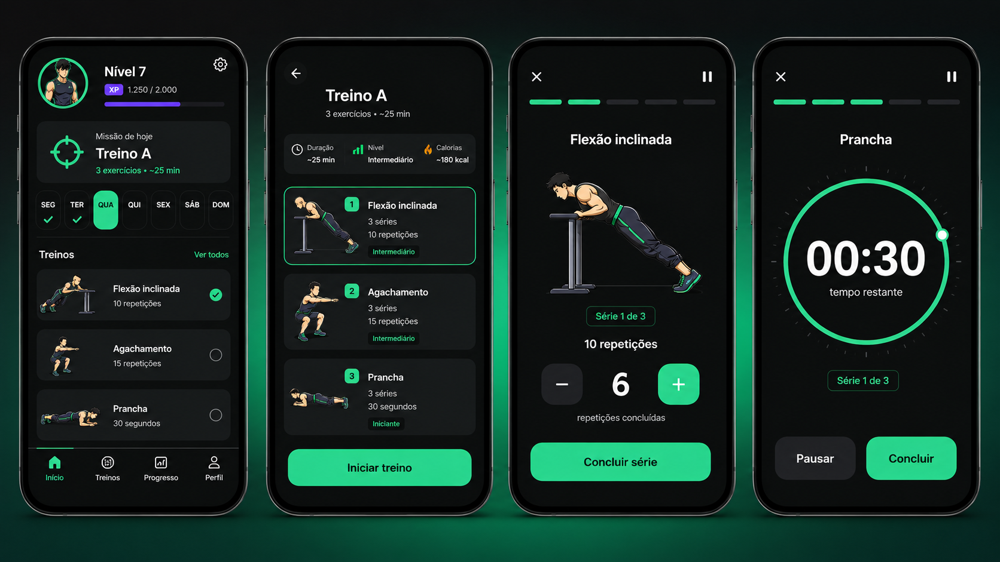
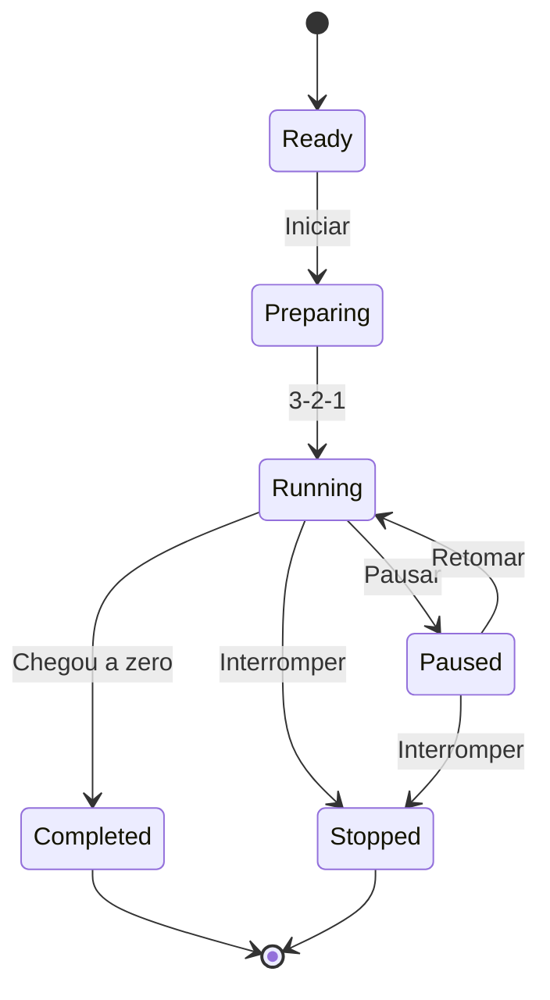

# Arquitetura Visual e Player de Treino

**Versão:** 1.0  
**Integra a documentação mestre:** 1.2  
**Plataforma inicial:** Flutter, Android e iOS  
**Operação inicial:** 100% offline  
**Referências visuais:** exemplos fornecidos pelo idealizador em 24/07/2026

## 1. Objetivo

Este documento transforma as referências visuais recebidas em uma arquitetura
original para o App RPG de Calistenia. A interface deve conservar os pontos
fortes dos exemplos:

- descoberta rápida dos treinos;
- cards com imagem e dose do exercício;
- player de execução com poucas distrações;
- progresso visível entre exercícios e séries;
- alvo de repetições grande e inequívoco;
- contador regressivo circular para exercícios por tempo;
- ações grandes, alcançáveis e fáceis de entender.

As referências são inspiração de hierarquia e interação. Não copiar marca,
logotipo, ilustração, texto, personagem, nome de programa ou composição exata
de outro aplicativo.

## 2. Resultado visual esperado



A prancha é uma direção visual, não uma captura que deva ser reproduzida pixel
por pixel. Durante a implementação:

- preservar as funções e a hierarquia descritas neste documento;
- usar componentes responsivos e tokens do tema;
- corrigir qualquer texto ou proporção imperfeita da arte conceitual;
- não extrair elementos gráficos diretamente da prancha;
- usar as ilustrações individuais do catálogo no aplicativo.

## 3. Princípios da experiência

1. **A missão vem antes dos números:** a dashboard mostra primeiro o que fazer
   hoje.
2. **Um exercício por vez:** durante a série, somente o essencial permanece na
   tela.
3. **Alvo não é resultado:** o plano sugere a dose; o usuário confirma o que
   realmente fez.
4. **Tempo real não depende do redesenho da tela:** o relógio é calculado pelo
   serviço de timer, não pela quantidade de frames.
5. **Segurança sempre visível:** dor, saída e pausa nunca ficam escondidas.
6. **Mídia orienta, mas não substitui instrução:** toda demonstração possui
   texto curto, critérios e erros comuns.
7. **Sem conexão obrigatória:** imagens, treino, timer e conclusão funcionam em
   modo avião.
8. **RPG orienta a jornada:** XP, nível e missão aparecem sem competir com a
   execução física.
9. **Acessibilidade desde o componente:** cor, áudio e animação nunca são o
   único meio de comunicar estado.

## 4. Identidade visual

### 4.1 Direção

Estética de “painel de missão atlética”:

- moderna;
- energética;
- escura;
- premium;
- limpa;
- sem aparência militar agressiva;
- sem estigmatizar corpos ou níveis iniciantes.

### 4.2 Tokens de cor

| Token | Valor inicial | Uso |
|---|---|---|
| `surface.canvas` | `#080A0B` | fundo principal |
| `surface.card` | `#141819` | cards |
| `surface.elevated` | `#1B2021` | modais e controles |
| `brand.primary` | `#35E6A1` | CTA, progresso e foco |
| `brand.primaryPressed` | `#20C987` | estado pressionado |
| `rpg.xp` | `#8B5CF6` | XP e progressão do personagem |
| `text.primary` | `#F7F9F8` | título e número principal |
| `text.secondary` | `#A7B0AD` | apoio |
| `state.warning` | `#F4B740` | atenção |
| `state.danger` | `#F45B69` | dor, parada e erro |
| `state.success` | `#35E6A1` | conclusão |
| `divider` | `#2A302F` | separadores |

Os valores devem ser validados em contraste. Cor nunca é o único sinal de
seleção, bloqueio, conclusão, aviso ou erro.

### 4.3 Tipografia

- família sem serifa legível e disponível para redistribuição;
- escala responsiva, sem alturas rígidas;
- números de timer e repetições com algarismos tabulares;
- título de tela: 24–28 sp;
- título de exercício: 22–26 sp;
- alvo principal: 48–72 sp conforme espaço;
- corpo: 16 sp;
- apoio: 13–14 sp, respeitando ampliação do sistema.

### 4.4 Espaçamento e forma

- grade base: 4 dp;
- margem de tela: 16 dp em telefone;
- espaço entre blocos: 16–24 dp;
- raio de card: 16–20 dp;
- botão principal: mínimo de 52 dp de altura;
- alvo de toque: mínimo de 48 × 48 dp;
- borda de foco e seleção: 2 dp;
- sombra discreta; a separação deve funcionar também sem sombra.

### 4.5 Movimento

- transições curtas entre 150 e 250 ms;
- conclusão pode usar microanimação e háptico;
- respeitar “reduzir animações”;
- demonstração animada deve pausar quando fora da tela;
- não usar flashes;
- não usar movimento automático decorativo durante uma série.

## 5. Arquitetura de navegação

### 5.1 Barra inferior

Cinco destinos:

1. **Jornada**
2. **Treinos**
3. **Habilidades**
4. **Evolução**
5. **Perfil**

A engrenagem continua no canto superior direito da dashboard como atalho para
`/settings`, conforme `SETTINGS_AND_TIMED_EXERCISES.md`.

### 5.2 Rotas

```text
/dashboard
/workouts
/workouts/:workoutId
/workouts/:workoutId/setup
/sessions/:sessionId/player
/sessions/:sessionId/rest
/sessions/:sessionId/summary
/skills
/progress
/profile
/settings
```

As rotas de uma sessão ativa recebem apenas IDs. O estado real é recuperado do
banco local e do controlador da sessão.

## 6. Dashboard — “Missão de hoje”

### 6.1 Hierarquia

1. avatar, nível, XP e engrenagem;
2. missão principal do dia;
3. seletor semanal;
4. resumo dos exercícios;
5. próxima habilidade;
6. histórico curto.

### 6.2 Card da missão

Exemplo:

```text
MISSÃO DE HOJE
Treino A · Fundação
3 exercícios · aproximadamente 25 min
[Iniciar treino]
```

O card apresenta:

- nome do treino;
- objetivo;
- quantidade de exercícios;
- duração estimada;
- estado `não iniciado`, `em andamento` ou `concluído`;
- botão que retoma a sessão, se já iniciada.

### 6.3 Lista curta de exercícios

Cada linha mostra:

- thumbnail;
- nome;
- dose, como `3 × 10` ou `3 × 30 s`;
- equipamento principal;
- marcador de concluído;
- indicador de substituição, quando aplicável.

Não mostrar calorias como promessa exata. Se forem usadas futuramente, devem
ser estimativas claramente identificadas.

## 7. Tela de treinos

### 7.1 Cabeçalho

- título `Treinos`;
- dias da semana;
- filtros `Todos`, `Iniciante`, `Intermediário`, `Avançado`;
- acesso ao calendário;
- acesso às preferências sem duplicar a engrenagem da dashboard.

### 7.2 Card de treino

Campos:

- arte/thumbnail original;
- nome;
- objetivo;
- nível;
- quantidade de exercícios;
- duração estimada;
- equipamentos;
- estado do dia;
- recompensa de missão, se houver.

### 7.3 Estados

- planejado;
- disponível;
- em andamento;
- concluído;
- adaptado;
- recuperação;
- bloqueado por segurança;
- conteúdo indisponível.

## 8. Detalhe do treino

Antes de iniciar, mostrar:

- nome e objetivo;
- duração;
- dificuldade;
- equipamentos;
- lista ordenada;
- aquecimento;
- exercício, séries e dose;
- descansos;
- substituições possíveis;
- aviso de segurança;
- botão `Iniciar treino`.

### 8.1 Linha de exercício

Exemplo por repetição:

```text
Flexão inclinada
3 séries · 10 repetições · descanso 60 s
```

Exemplo por tempo:

```text
Prancha
3 séries · 30 segundos · descanso 45 s
```

Exemplo configurável:

```text
Alongamento de flexor do quadril
2 séries · escolha entre 20 e 45 segundos por lado
```

## 9. Preparação da sessão

Fluxo:

1. check-in de prontidão;
2. confirmação de equipamento;
3. escolha permitida de duração nos exercícios configuráveis;
4. resumo da dose final;
5. início.

Não perguntar o tempo antes de cada série se a escolha vale para todas as
séries do mesmo exercício. Permitir ajuste posterior apenas dentro dos limites
e sem ultrapassar uma redução de segurança aplicada pelo motor.

### 9.1 Seletor de duração

Elementos:

- recomendação destacada;
- chips com presets;
- opção `Personalizar`;
- seletor em segundos ou minutos;
- mínimo e máximo;
- texto de segurança;
- botão `Aplicar a todas as séries`.

Exemplo:

```text
Quanto tempo deseja manter?
[20 s] [30 s recomendado] [40 s] [Personalizar]
Permitido para esta versão: 15–45 segundos.
```

O valor final é armazenado em segundos inteiros.

## 10. Shell do player

Todas as modalidades compartilham:

- sair;
- pausa;
- tempo total da sessão;
- barra segmentada de progresso;
- mídia do exercício;
- nome;
- série atual;
- área de dose específica;
- instrução curta;
- `Senti dor`;
- ação principal;
- menu acessível de substituição e encerramento.

### 10.1 Barra segmentada

Cada segmento representa um item executável:

- cinza: futuro;
- verde: concluído;
- branco com contorno: atual;
- amarelo com ícone: adaptado;
- vermelho com ícone: interrompido por dor.

### 10.2 Mídia

Ordem de preferência:

1. WebP animado ou vídeo curto revisado;
2. duas imagens estáticas, início e fim;
3. uma imagem estática;
4. placeholder com ícone e instruções.

A sessão nunca é bloqueada apenas pela falta de mídia. Exercícios cujo
entendimento seguro depende de demonstração podem, porém, ficar com estado de
conteúdo `não publicável`.

## 11. Modalidade por repetições

### 11.1 Regra central

O aplicativo mostra o alvo até o usuário informar que concluiu. O telefone não
presume que as repetições foram realizadas e não reduz o número
automaticamente.

Exemplo:

```text
Flexão inclinada
Série 1 de 3

ALVO
10 repetições

[−] 10 [+]
repetições realmente concluídas

[Concluir série]
```

### 11.2 Estado inicial

- `target_reps = 10`;
- `performed_reps` começa igual ao alvo para confirmação rápida;
- o usuário pode ajustar com `−` e `+`;
- a série só é salva após `Concluir série`;
- não ganhar XP pela mera abertura da tela.

Para testes máximos, `performed_reps` começa em zero e o usuário registra o
resultado real ao terminar.

### 11.3 Confirmação

Ao tocar em `Concluir série`:

1. validar limite;
2. solicitar RPE/RIR quando previsto;
3. perguntar sobre dor de forma breve;
4. salvar `target_reps` e `performed_reps`;
5. abrir descanso ou próximo exercício;
6. atualizar a projeção visual;
7. processar progressão apenas na conclusão transacional da sessão.

### 11.4 Quantidade diferente

Se o usuário registrar menos:

- aceitar sem punição;
- perguntar opcionalmente `faltou força`, `técnica`, `dor`, `interrupção` ou
  `outro`;
- adaptar séries posteriores conforme as regras.

Se registrar mais:

- limitar pela faixa e pelo `max_test_cap`;
- não sugerir repetições extras durante testes ou exercícios com limite de
  segurança;
- registrar que o alvo foi superado sem liberar automaticamente outra
  habilidade.

### 11.5 Cadência opcional

Exercícios com tempo por repetição podem exibir:

```text
3 s descendo · 1 s de pausa · subir controlando
```

Esse guia não substitui o contador de repetições. Um metrônomo opcional pode
ser adicionado posteriormente.

## 12. Modalidade por duração

### 12.1 Casos

- isometria;
- alongamento;
- mobilidade sustentada;
- hang;
- suporte;
- respiração;
- descanso.

### 12.2 Estados do contador



### 12.3 Tela pronta

Mostra:

- duração selecionada;
- instruções;
- lado, quando unilateral;
- botão `Iniciar`;
- opção `Sem contagem preparatória`, se habilitada nas configurações.

### 12.4 Contagem preparatória

Padrão: `3, 2, 1`.

- som opcional;
- voz opcional;
- vibração opcional;
- nenhum segundo é contabilizado como execução.

### 12.5 Contagem ativa

Mostrar:

- `MM:SS`;
- arco de progresso;
- série;
- lado;
- `Pausar`;
- `Senti dor`;
- instrução curta.

O arco é uma representação. A autoridade é o serviço monotônico descrito em
`SETTINGS_AND_TIMED_EXERCISES.md`.

### 12.6 Ao chegar a zero

- emitir som/voz/háptico conforme preferência;
- registrar `completed_by_countdown`;
- salvar tempo ativo;
- não avançar sem dar ao usuário opção de interromper em segurança;
- iniciar descanso automático apenas se a preferência estiver ativa.

### 12.7 Interrupção antes do fim

O usuário pode tocar em `Concluir agora` ou `Interromper`.

Salvar:

- meta;
- tempo ativo;
- motivo;
- dor;
- série;
- lado;
- timestamps;
- estado de integridade.

Tempo parcial é desempenho real, não falha moral.

## 13. Modalidade por repetições ou duração

Quando `dose_type = reps_or_duration`, o plano escolhe uma modalidade antes da
sessão. O player não alterna silenciosamente durante a execução.

Exemplo:

- mountain climber: `20 repetições totais`; ou
- mountain climber: `30 segundos`.

O histórico precisa guardar a modalidade usada para permitir comparação justa.

## 14. Descanso

Tela simples:

- `Descanso`;
- contagem regressiva;
- próximo exercício;
- thumbnail;
- `Pular descanso`;
- `+15 s`, se permitido;
- pausar sessão;
- acesso a dor.

Pular ou estender descanso não gera nem remove XP. O motor pode usar esse dado
para estimar carga e aderência.

## 15. Final da sessão

### 15.1 Resumo

- exercícios concluídos;
- séries planejadas e realizadas;
- repetições-alvo e realizadas;
- tempo-alvo e ativo;
- adaptações;
- recordes válidos;
- XP concedido;
- progresso de habilidade;
- pergunta de esforço global;
- estado de recuperação recomendado.

### 15.2 Mensagem

Evitar:

```text
Você falhou em 2 séries.
```

Preferir:

```text
Você concluiu 8 de 10 séries planejadas.
O próximo treino será ajustado para preservar a técnica.
```

## 16. Fluxo de dor

O botão `Senti dor` fica visível no player.

Ao tocar:

1. pausar timer, se ativo;
2. parar a série;
3. perguntar local e intensidade;
4. aplicar as regras de segurança;
5. oferecer somente substituição permitida ou encerramento;
6. persistir o evento;
7. não premiar insistência.

## 17. Componentes Flutter

Estrutura recomendada:

```text
lib/features/workout_player/
├── domain/
│   ├── entities/
│   ├── services/
│   └── value_objects/
├── application/
│   ├── workout_player_controller.dart
│   ├── repetition_set_controller.dart
│   ├── timed_set_controller.dart
│   └── rest_controller.dart
├── data/
│   ├── workout_session_repository.dart
│   └── active_timer_repository.dart
└── presentation/
    ├── pages/
    ├── widgets/
    └── semantics/
```

Widgets principais:

```text
WorkoutPlayerPage
PlayerTopBar
SegmentedWorkoutProgress
ExerciseMediaPanel
ExerciseTitleBlock
SetIndicator
RepetitionDosePanel
TimedDosePanel
CircularCountdown
RestPanel
PainAction
PrimaryCompletionButton
ExerciseInstructionSheet
MediaPlaceholder
```

Widgets não escrevem diretamente no Drift. Eles enviam intenções ao
controlador, que usa casos de uso e repositórios.

## 18. Estados de apresentação

```dart
sealed class WorkoutPlayerState {}

final class PlayerLoading extends WorkoutPlayerState {}
final class PlayerReady extends WorkoutPlayerState {}
final class RepetitionSetActive extends WorkoutPlayerState {}
final class TimedSetReady extends WorkoutPlayerState {}
final class TimedSetPreparing extends WorkoutPlayerState {}
final class TimedSetRunning extends WorkoutPlayerState {}
final class TimedSetPaused extends WorkoutPlayerState {}
final class RestRunning extends WorkoutPlayerState {}
final class PainFlowActive extends WorkoutPlayerState {}
final class SessionCompleting extends WorkoutPlayerState {}
final class SessionCompleted extends WorkoutPlayerState {}
final class PlayerRecoverableError extends WorkoutPlayerState {}
```

O exemplo é conceitual; adaptar à solução de estado já presente no repositório.

## 19. Modelo de dose

```dart
enum DoseType {
  repetitions,
  duration,
  repetitionsOrDuration,
}

final class PlannedSetDose {
  final DoseType type;
  final int? targetReps;
  final int? targetSeconds;
  final int? minAllowed;
  final int? maxAllowed;
  final int? safetyCap;
}

final class CompletedSetDose {
  final int? performedReps;
  final int? activeMilliseconds;
  final String completionReason;
  final bool painReported;
}
```

Nunca reutilizar o mesmo campo inteiro de forma ambígua para repetições e
segundos.

## 20. Persistência de sessão ativa

Persistir:

- sessão;
- exercício atual;
- série;
- lado;
- dose;
- estado;
- eventos;
- início monotônico disponível na execução;
- timestamps de parede para recuperação;
- tempo ativo acumulado;
- última atualização;
- `journey_generation`;
- versões de catálogo e regra.

Se o app fechar:

- recuperar a sessão;
- reconstruir o estado;
- nunca inventar repetições;
- recomputar timer conforme as regras;
- pedir confirmação quando houver ambiguidade;
- evitar recompensa duplicada.

## 21. Semântica e acessibilidade

Exemplos:

```text
“Flexão inclinada. Série 1 de 3. Alvo: 10 repetições.”
“Diminuir repetições realizadas.”
“Aumentar repetições realizadas.”
“Concluir série com 8 repetições.”
“Prancha. 30 segundos restantes. Timer em andamento.”
```

Requisitos:

- ordem de foco lógica;
- timer não anunciar cada segundo;
- avisar em marcos configuráveis, como 10 e 5 segundos;
- `Concluir` e `Senti dor` não podem ser confundidos;
- botões apenas com ícone possuem rótulo;
- orientação não depende da imagem;
- suporte a texto grande sem cortar o CTA;
- paisagem e telas pequenas devem permanecer utilizáveis.

## 22. Estados de mídia

| Estado | Comportamento |
|---|---|
| `available` | exibir mídia local validada |
| `placeholder` | exibir silhueta + instrução |
| `under_review` | disponível apenas em ambiente interno |
| `retired` | não prescrever em novos planos |
| `missing` | registrar lacuna e usar fallback |
| `load_error` | fallback imediato, sem travar sessão |

O catálogo deve poder publicar um exercício com placeholder apenas quando as
instruções textuais forem suficientes e a equipe de conteúdo aprovar. Técnicas
complexas ou de alto risco exigem demonstração revisada.

## 23. Analytics local

Na fase offline, eventos ficam no aparelho:

```text
workout_opened
workout_started
exercise_viewed
exercise_media_failed
rep_count_adjusted
set_completed
timed_set_started
timed_set_paused
timed_set_resumed
timed_set_completed
timed_set_stopped
rest_skipped
pain_reported
exercise_substituted
session_completed
session_recovered
```

Não usar analytics de terceiros na primeira versão.

## 24. Critérios de aceite

### 24.1 Dashboard

- mostra missão, exercícios e progresso sem rede;
- engrenagem abre configurações;
- retomar sessão não cria outra sessão;
- texto ampliado não esconde início.

### 24.2 Repetições

- alvo permanece visível;
- usuário confirma ou ajusta o realizado;
- salvar separa alvo e resultado;
- toque repetido em concluir não duplica a série;
- menos repetições não gera mensagem punitiva;
- limite inválido é rejeitado com explicação.

### 24.3 Tempo

- duração respeita mínimo, máximo e teto de segurança;
- timer funciona após bloquear a tela;
- pausa não entra no tempo ativo;
- fechar e reabrir recupera a série;
- chegada a zero registra uma única conclusão;
- interromper salva tempo parcial;
- lado esquerdo e direito não são confundidos.

### 24.4 Mídia

- ausência, corrupção ou erro de decodificação não fecha o app;
- placeholder possui nome e instruções;
- mídia respeita reduzir animações;
- imagem não é cortada;
- cada mídia corresponde à versão do exercício.

### 24.5 Segurança

- botão de dor está sempre acessível;
- dor pausa o timer;
- progressão não depende apenas da conclusão visual;
- exercício aposentado permanece no histórico;
- exercício não revisado não entra em plano público.

## 25. Testes essenciais

### Unitários

- validação de reps;
- validação de segundos;
- presets;
- limites;
- transições do player;
- tempo ativo;
- idempotência;
- escolha de fallback de mídia.

### Widget

- player de reps;
- player de tempo;
- texto grande;
- leitor de tela;
- rotação;
- placeholder;
- dor;
- descanso.

### Integração

- sessão completa offline;
- encerramento durante timer;
- recuperação após processo morto;
- reinício da jornada com sessão antiga;
- migração do banco;
- mídia ausente;
- toque duplo em concluir.

### Golden

Tamanhos mínimos:

- telefone compacto;
- telefone padrão;
- telefone grande;
- texto 100%, 150% e 200%;
- tema escuro;
- reduzir animações.

## 26. Ordem de implementação

1. tokens e componentes básicos;
2. dashboard e cards;
3. detalhe do treino;
4. shell do player;
5. modalidade por repetições;
6. descanso;
7. modalidade por tempo;
8. recuperação;
9. mídia e placeholder;
10. resumo;
11. acessibilidade;
12. testes de fluxo.

## 27. Fora do primeiro corte

- contagem automática por câmera;
- correção postural por IA;
- download remoto de mídia;
- streaming;
- ranking online;
- treino social ao vivo;
- sincronização Supabase;
- anúncios dentro do player.

## 28. Prompt específico para Claude Code

```text
Leia integralmente:

1. App_RPG_Calistenia_Documentacao/README.md
2. App_RPG_Calistenia_Documentacao/01_SAFETY/SAFETY_AND_SCREENING.md
3. App_RPG_Calistenia_Documentacao/05_EXERCISES/EXERCISE_SCHEMA.md
4. App_RPG_Calistenia_Documentacao/05_EXERCISES/EXERCISE_MEDIA_GUIDE.md
5. App_RPG_Calistenia_Documentacao/07_UX/SCREENS_AND_FLOWS.md
6. App_RPG_Calistenia_Documentacao/07_UX/VISUAL_ARCHITECTURE_AND_WORKOUT_PLAYER.md
7. App_RPG_Calistenia_Documentacao/07_UX/SETTINGS_AND_TIMED_EXERCISES.md
8. App_RPG_Calistenia_Documentacao/08_ARCHITECTURE/DATA_MODEL.md
9. App_RPG_Calistenia_Documentacao/09_QUALITY/TEST_STRATEGY.md

Implemente uma história vertical offline do player:

- dashboard com missão de hoje;
- detalhe do treino com Flexão inclinada, Agachamento e Prancha;
- player por repetições que mantém o alvo visível e só salva depois da
  confirmação do usuário;
- ajuste de repetições realmente concluídas;
- player por duração com 3-2-1, contagem regressiva, pausa, retomada,
  conclusão e interrupção;
- descanso;
- recuperação após fechar o app;
- imagens locais e placeholder;
- botão Senti dor sempre acessível;
- persistência SQLite/Drift transacional e idempotente.

Use a prancha visual como direção, não como imagem de interface. Construa
widgets nativos responsivos. Não adicione Supabase, Firebase, login, API,
download de mídia, câmera ou IA.

Antes de editar:

1. inspecione o repositório e regras locais;
2. compare código e documentação;
3. apresente plano, migrations, arquivos e testes;
4. não sobrescreva alterações existentes;
5. identifique decisões ainda ausentes.

Considere concluído somente depois de:

- flutter analyze sem novos erros;
- testes unitários, de widget e de integração do fluxo;
- teste manual em modo avião;
- teste com tela bloqueada;
- teste de toque duplo em Concluir;
- atualização de PROJECT_STATUS.md.
```
