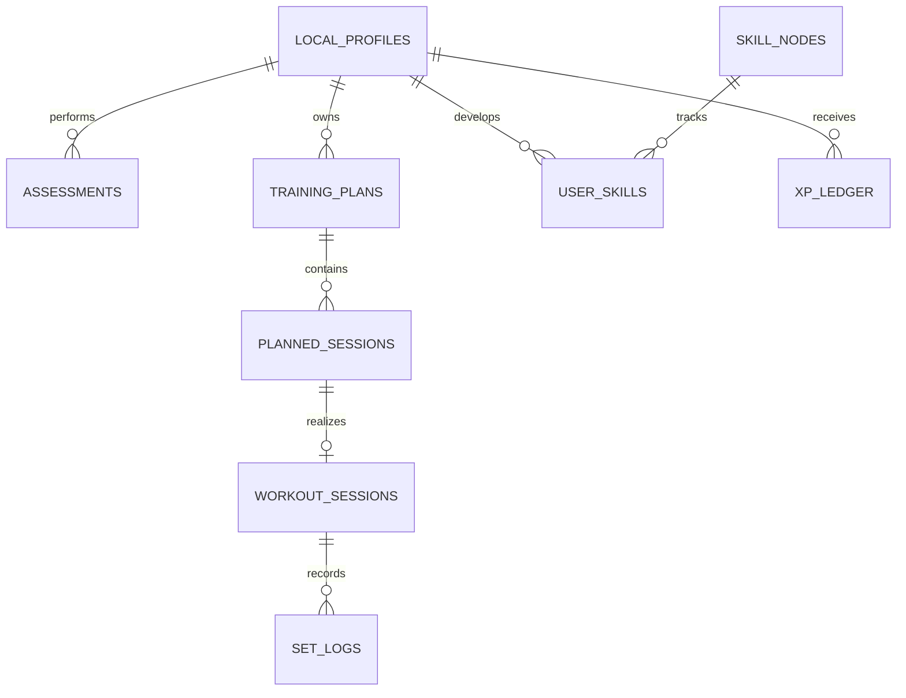

# Modelo de Dados

Na primeira versão, estas entidades vivem no SQLite/Drift do aparelho. IDs são
UUIDs em texto, timestamps canônicos são UTC em milissegundos e
`sync_state = local_only`. Supabase e RLS pertencem ao roadmap Fase 4.

## 1. Entidades principais



## 2. Tabelas

### Identidade e perfil

- `local_profiles`
- `user_preferences`
- `user_settings`
- `user_equipment`
- `user_goals`
- `body_measurements`
- `consents`
- `safety_screenings`
- `pain_flags`

### Conteúdo

- `exercises`
- `exercise_versions`
- `exercise_media`
- `exercise_relations`
- `skill_trees`
- `skill_nodes`
- `skill_edges`
- `mastery_rules`
- `content_reviews`

### Avaliação

- `assessments`
- `assessment_protocol_versions`
- `assessment_attempts`
- `capability_estimates`

### Treino

- `training_plans`
- `plan_weeks`
- `planned_sessions`
- `planned_exercises`
- `workout_sessions`
- `set_logs`
- `readiness_checkins`
- `session_adjustments`
- `sync_receipts`

### Progressão e RPG

- `user_skills`
- `mastery_evidence`
- `user_attributes`
- `xp_ledger`
- `level_definitions`
- `campaigns`
- `phases`
- `missions`
- `user_missions`
- `achievements`
- `user_achievements`
- `reward_claims`

### Operação

- `rule_versions`
- `feature_flags`
- `integrity_flags`
- `audit_events`
- `notification_outbox`
- `journey_reset_requests`

## 3. Campos críticos

### `workout_sessions`

```sql
id uuid primary key
user_id uuid not null
client_session_id uuid not null
planned_session_id uuid null
status text not null
started_at timestamptz not null
completed_at timestamptz null
timezone text not null
device_started_at timestamptz null
catalog_version text not null
rule_version text not null
processed_at timestamptz null
unique(user_id, client_session_id)
```

### `set_logs`

- IDs de sessão, exercício e versão;
- ordem do evento;
- `dose_type`;
- `target_reps` e `performed_reps`, sem reutilizar um campo ambíguo;
- `target_seconds` e `active_duration_ms`;
- assistência;
- RPE/RIR;
- dor;
- motivo de parada;
- checklist técnico;
- timestamps UTC do aparelho; timestamp do servidor será adicionado na fase de nuvem;
- estado de integridade.

### `exercise_media`

- exercício e versão;
- chave estável;
- papel `thumbnail`, `start`, `end`, `demo`, `setup` ou `exit`;
- tipo de mídia;
- path local;
- fallback;
- dimensões e duração;
- loop;
- rótulo semântico;
- versão de instrução;
- estado da revisão técnica;
- checksum.

No MVP, `asset_path` não pode ser URL. A ausência ou falha de mídia usa
placeholder e não encerra a sessão.

### `xp_ledger`

- `id`;
- `user_id`;
- `amount` positivo/negativo;
- `event_type`;
- `source_id`;
- `idempotency_key` única;
- `rule_version`;
- `created_at`;
- `metadata` limitada e não sensível.

Saldo é soma do ledger, podendo existir projeção/cache reconciliável.

### `user_skills`

- estado atual;
- data do primeiro domínio;
- capacidade atual válida até;
- confiança;
- melhor evidência;
- regra usada;
- regressão temporária sem apagar conquista.

## 4. Invariantes

- um usuário só lê seus dados privados;
- sessão pertence a um único usuário;
- exercício prescrito referencia versão publicada;
- XP possui origem única;
- evidência usada em domínio não tem dor impeditiva;
- nó só domina se arestas obrigatórias forem satisfeitas;
- conteúdo aposentado permanece referenciável no histórico;
- alteração administrativa gera auditoria;
- dado de triagem nunca aparece em tabela pública.
- evento offline pertence à geração atual da jornada;
- reinício da jornada não apaga o perfil local;
- tempo-alvo e tempo ativo executado são dados diferentes.
- repetições-alvo e repetições realizadas são dados diferentes;
- completar uma série é idempotente;
- mídia publicada corresponde à versão do exercício e possui revisão;

## 5. Índices iniciais

- sessões por `(user_id, started_at desc)`;
- fila por `(status, completed_at)`;
- sets por `(workout_session_id, sequence)`;
- capacidades por `(user_id, pattern, estimated_at desc)`;
- skills por `(user_id, skill_node_id)` único;
- ledger por `(user_id, created_at desc)` e idempotency key única;
- missões por usuário/status/janela;
- flags por status/severidade.

## 6. Retenção

Definir por categoria:

- perfil local;
- saúde e triagem;
- sessões;
- mídia de câmera;
- auditoria;
- telemetria.

Vídeo deve ter retenção curta por padrão e consentimento explícito. Exclusão deve respeitar obrigações legais sem manter dados desnecessários.
