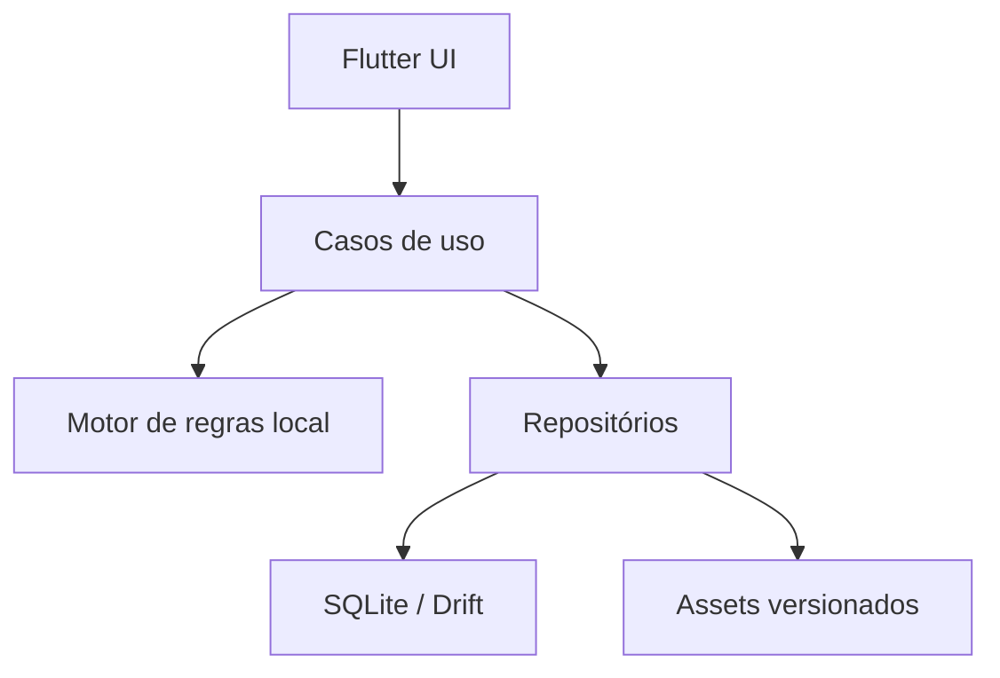

# Arquitetura Técnica

**Decisão vigente em 24/07/2026:** a primeira versão funciona totalmente
offline e não se conecta ao Supabase. O Supabase é uma fase futura.

## 1. Fases da arquitetura

### Roadmap Fases 1–3 — aplicativo local e offline

- **Cliente:** Flutter/Dart para Android e iOS;
- **Persistência:** SQLite com Drift, ou alternativa local justificada;
- **Estado:** solução previsível com separação entre apresentação, domínio e dados;
- **Identidade:** perfil local com UUID criado na primeira execução;
- **Conteúdo:** catálogo de exercícios empacotado e versionado no aplicativo;
- **Regras:** motor determinístico executado localmente;
- **Mídia:** assets locais otimizados;
- **Backup:** exportação manual opcional, sem nuvem no MVP;
- **Rede:** nenhuma dependência para avaliar, gerar plano, treinar, usar timer,
  ganhar XP ou consultar progresso.

### Roadmap Fase 4 — nuvem e múltiplos dispositivos

Adicionar futuramente:

- Supabase Auth;
- PostgreSQL;
- RLS;
- Storage;
- Edge Functions;
- sincronização e resolução de conflitos;
- catálogo remoto;
- validação autoritativa de recompensas competitivas;
- Firebase Cloud Messaging, se notificações remotas forem necessárias.

A fase de nuvem não deve ser implementada agora.

## 2. Componentes da versão local



Não criar camada de rede vazia apenas por antecipação. Criar interfaces de
repositório que possam receber uma implementação remota no futuro.

## 3. Módulos Flutter

```text
lib/
  app/
  core/
    database/
    ids/
    clock/
    export/
    accessibility/
  features/
    onboarding/
    safety/
    assessment/
    training_plan/
    workout_session/
    workout_player/
    workout_timer/
    exercise_media/
    exercises/
    skill_tree/
    gamification/
    progress/
    profile/
    settings/
    journey_reset/
  shared/
```

Cada feature contém `domain`, `data` e `presentation` conforme necessidade.
Regras críticas não ficam em widgets.

## 4. Fonte de verdade na versão local

| Dado | Autoridade |
|---|---|
| perfil | banco local |
| sessão em andamento | banco local |
| catálogo | assets locais versionados |
| plano ativo | banco local, gerado pelo motor de regras |
| XP e nível | ledger local processado transacionalmente |
| domínio de habilidade | evidências e regras locais versionadas |
| timer | relógio monotônico + estado persistido local |
| mídia | manifesto local + assets empacotados + fallback |
| configurações | banco local |
| regras | código/conteúdo versionado no Git |

O aplicativo deve continuar funcional em modo avião desde a primeira abertura,
salvo download inicial do próprio aplicativo pelas lojas.

## 5. Banco local

Recomenda-se Drift sobre SQLite por:

- schema tipado;
- migrations locais;
- transações;
- streams reativas;
- testes em memória;
- possibilidade de exportar dados;
- boa integração com Flutter.

Requisitos:

- migration incremental e testada;
- nenhuma perda silenciosa após atualização do app;
- foreign keys ativadas;
- transações para finalização, XP, domínio e reset;
- IDs UUID gerados no aparelho;
- timestamps UTC em milissegundos;
- versão de catálogo e regra em todo resultado;
- ledger append-only para XP;
- backup antes de migration destrutiva, quando aplicável.

## 6. Preparação para o Supabase futuro

Mesmo offline, usar:

```text
id                 UUID/string estável
local_profile_id   UUID/string
created_at_utc     timestamp UTC
updated_at_utc     timestamp UTC
rule_version       string
catalog_version    string
journey_generation integer
sync_state         local_only
```

Não usar:

- IDs autoincrementais como identidade pública futura;
- horário local sem fuso como dado canônico;
- campos derivados como única fonte do histórico;
- XP salvo apenas como saldo mutável;
- referências por nome de exercício;
- dados importantes somente em memória.

`sync_state` permanece `local_only` na Fase 1. Estados como `pending`,
`synced` e `conflict` serão adicionados somente na fase de nuvem.

## 7. Finalização local idempotente

1. criar `client_session_id` antes de iniciar;
2. persistir cada série;
3. concluir a sessão em uma transação;
4. verificar se `client_session_id` já foi processado;
5. calcular evidências, domínio, XP e missões uma única vez;
6. gravar recibo local;
7. retornar o mesmo recibo em repetição.

Assim o aplicativo evita XP duplicado mesmo sem servidor e já se prepara para
sincronização futura.

## 8. Perfil local

Na primeira execução:

1. gerar `local_profile_id` UUID;
2. salvar no banco;
3. criar `journey_generation = 1`;
4. iniciar onboarding;
5. não exigir conta, e-mail ou internet.

Se o usuário reinstalar ou limpar os dados do sistema operacional sem exportar
backup, o progresso local será perdido. Essa limitação deve ser informada de
forma clara.

## 9. Exportação e restauração

Para reduzir o risco de perda antes da nuvem:

- permitir exportar um arquivo de backup versionado;
- não incluir segredos;
- permitir proteger o backup conforme decisão de produto;
- validar checksum e versão ao importar;
- nunca importar parcialmente;
- criar cópia de segurança antes de substituir dados;
- diferenciar `importar backup` de `recomeçar jornada`.

A importação pode ser uma entrega posterior ao MVP, mas o schema deve ser
exportável desde o início.

## 10. Segurança local

- armazenar preferências não sensíveis no SQLite;
- usar armazenamento seguro do SO somente para segredos futuros;
- não registrar triagem, peso, dor ou IMC em logs;
- impedir backup automático não protegido quando houver dados sensíveis,
  conforme decisão de privacidade;
- ofuscação não substitui proteção de dados;
- validar arquivos importados;
- não confiar em valores alterados fora do fluxo normal;
- deixar claro que, sem servidor, proteção antifraude competitiva é limitada.

Rankings globais, PvP e recompensas com valor econômico devem aguardar a fase
de nuvem do roadmap.

## 11. Regras versionadas

Toda prescrição aponta para:

- `catalog_version`;
- `training_rule_version`;
- `mastery_rule_version`;
- `gamification_version`.

Uma atualização não recalcula o passado automaticamente. Migrations e rotinas
de reconciliação local devem ser explícitas e testadas.

## 12. Migração futura para Supabase

Quando a fase de nuvem começar:

1. criar autenticação;
2. vincular o `local_profile_id` a `auth.uid()` após consentimento;
3. exportar um snapshot local consistente;
4. enviar eventos e ledgers com IDs originais;
5. validar versões e duplicidades no backend;
6. aplicar RLS;
7. receber recibo de importação;
8. somente então marcar itens como sincronizados;
9. manter cópia local para uso offline;
10. testar conflito entre dois dispositivos.

O primeiro upload deve ser idempotente. Repetir a importação não pode duplicar
sessões, XP, avaliações ou habilidades.

## 13. IA e câmera — fase posterior

IA pode:

- resumir histórico;
- explicar decisão já calculada;
- sugerir conteúdo ao profissional;
- estimar pontos de técnica com confiança.

IA não deve:

- ignorar bloqueios;
- diagnosticar;
- conceder domínio sozinha em habilidade crítica;
- alterar prescrição sem regra e auditoria;
- inventar exercícios fora do catálogo publicado.

## 14. Decisões arquiteturais a registrar

Criar ADRs para:

- mecanismo de estado Flutter;
- Drift ou alternativa;
- formato de IDs e timestamps;
- estratégia de backup;
- criptografia de backup;
- versionamento do catálogo;
- relógio monotônico do timer;
- política de migrations locais;
- vínculo futuro entre perfil local e Supabase Auth;
- estratégia de sincronização da fase de nuvem.
- formato e verificação do manifesto de mídia;
- política de memória e pré-carregamento de animações;
